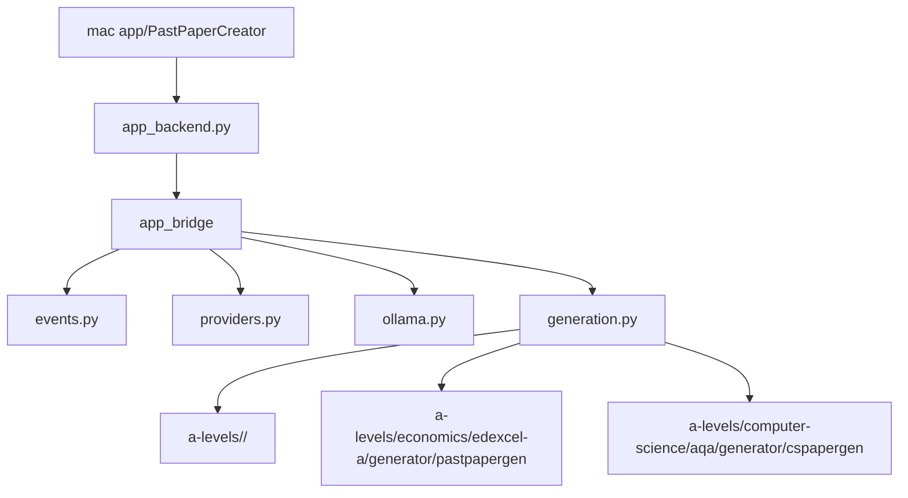

# Past Paper Creation

Subject folders:

- `a-levels/economics/edexcel-a/generator/` - A-Level Economics Edexcel A practice paper generator.
- `a-levels/computer-science/aqa/generator/` - AQA A-Level Computer Science Paper 2 practice paper generator.
- `a-levels/` - resource packs by subject and exam board. Non-ready boards are kept as coming-soon folders.
- `mac app/` - native SwiftUI wrapper around the Python generators.
- `app_bridge/` - JSONL backend package used by the mac app.
- `app_backend.py` - stable executable shim for the Swift app and tests.
- `tests/` - root-level bridge tests.

Each ready board keeps its own README, package, tests and data inside its `generator/` folder.
Generated PDFs go to `~/Downloads`; runtime caches live under `~/Library/Caches/Past Paper Creation/`.

## Project Layout



`app_backend.py` should stay tiny. Add app-facing backend work inside `app_bridge/`.
The app catalog can show coming-soon A-level subjects before their generators exist.

## Economics Quick Start

```bash
cd a-levels/economics/edexcel-a/generator
../../../../.venv/bin/python -m pip install -e ".[dev]"
../../../../.venv/bin/python generate_paper.py
```

## Computer Science Quick Start

```bash
cd a-levels/computer-science/aqa/generator
../../../../.venv/bin/python -m pip install -e ".[dev]"
../../../../.venv/bin/python generate_cs_paper.py
```

Computer Science outputs:

- `~/Downloads/cs-paper-2-question-paper.pdf`
- `~/Downloads/cs-paper-2-mark-scheme.pdf`

## Mac App

```bash
cd "mac app"
make build
make build-app-store
make preflight-app-store
```

If `xcodebuild` reports that the active developer directory is Command Line Tools, run:

```bash
sudo xcode-select -s /Applications/Xcode.app/Contents/Developer
```

The app calls `app_backend.py`, which emits JSON progress events while reusing the subject generators. Generation runs without blocking the UI and can send optional macOS notifications when a job starts, completes, or fails. The direct download build can open the Ollama download page and pull local models. `make build-app-store` sets `DistributionMode=app-store`, which disables those installer/model-management features and only detects an existing Ollama setup.

## Privacy

Ollama generation is local through the Python generators. No analytics, tracking, accounts, or remote paper upload are included.

Hosted AI providers are optional. If selected, prompts, syllabus context, and draft paper content are sent only to the provider chosen by the user. The macOS app asks for explicit consent before hosted AI is used, stores API keys in Keychain, and includes a privacy manifest declaring no collected data and UserDefaults usage for app preferences.

Generated PDFs stay in the output folder selected by the user. API keys can be removed by clearing them in Settings. Local preferences can be reset by deleting the app's container/preferences. No server-side account data is retained by this project.

## App Store Review Notes

- App Sandbox is enabled.
- Notifications are optional and are not required to use the app.
- The App Store build path is explicit: `cd "mac app" && make build-app-store`.
- App Store builds must not install Ollama, pull model executables, or materially change app functionality after review.
- App metadata should avoid implying Pearson, Edexcel, AQA, or any exam-board affiliation.
- The review notes should explain the direct/App Store build difference and provide a working model/API setup for review.
