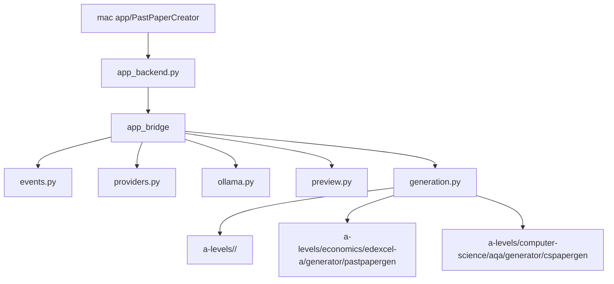

# Past Paper Creation

Subject folders:

- `a-levels/economics/edexcel-a/generator/` - A-Level Economics Edexcel A practice paper generator.
- `a-levels/computer-science/aqa/generator/` - AQA A-Level Computer Science Paper 2 practice paper generator.
- `a-levels/` - resource packs by subject and exam board. Non-ready boards are kept as coming-soon folders.
- `mac app/` - native SwiftUI wrapper around the Python generators.
- `app_bridge/` - JSONL backend package used by the mac app.
- `app_backend.py` - stable executable shim for the Swift app and tests.
- `tests/` - root-level bridge tests.

Each ready board keeps its own README, package, tests and data inside its `generator/` folder.
Generated PDFs go to `~/Downloads`; runtime caches live under `~/Library/Caches/Past Paper Creation/`.

## Project Layout



`app_backend.py` should stay tiny. Add app-facing backend work inside `app_bridge/`.
The app catalog can show coming-soon A-level subjects before their generators exist.

## Economics Quick Start

```bash
cd a-levels/economics/edexcel-a/generator
../../../../.venv/bin/python -m pip install -e ".[dev]"
../../../../.venv/bin/python generate_paper.py
```

## Computer Science Quick Start

```bash
cd a-levels/computer-science/aqa/generator
../../../../.venv/bin/python -m pip install -e ".[dev]"
../../../../.venv/bin/python generate_cs_paper.py
```

Computer Science outputs:

- `~/Downloads/cs-paper-2-question-paper.pdf`
- `~/Downloads/cs-paper-2-mark-scheme.pdf`

## Mac App

```bash
cd "mac app"
make build
```

If `xcodebuild` reports that the active developer directory is Command Line Tools, run:

```bash
sudo xcode-select -s /Applications/Xcode.app/Contents/Developer
```

The app calls `app_backend.py`, which emits JSON progress events while reusing the subject generators. The direct download build can open the Ollama download page and pull local models. An App Store build must keep those installer features disabled and only detect an existing Ollama setup.

## Privacy

Generation is local-only through the Python generators and Ollama. No analytics, tracking, accounts, or remote paper upload are included.
