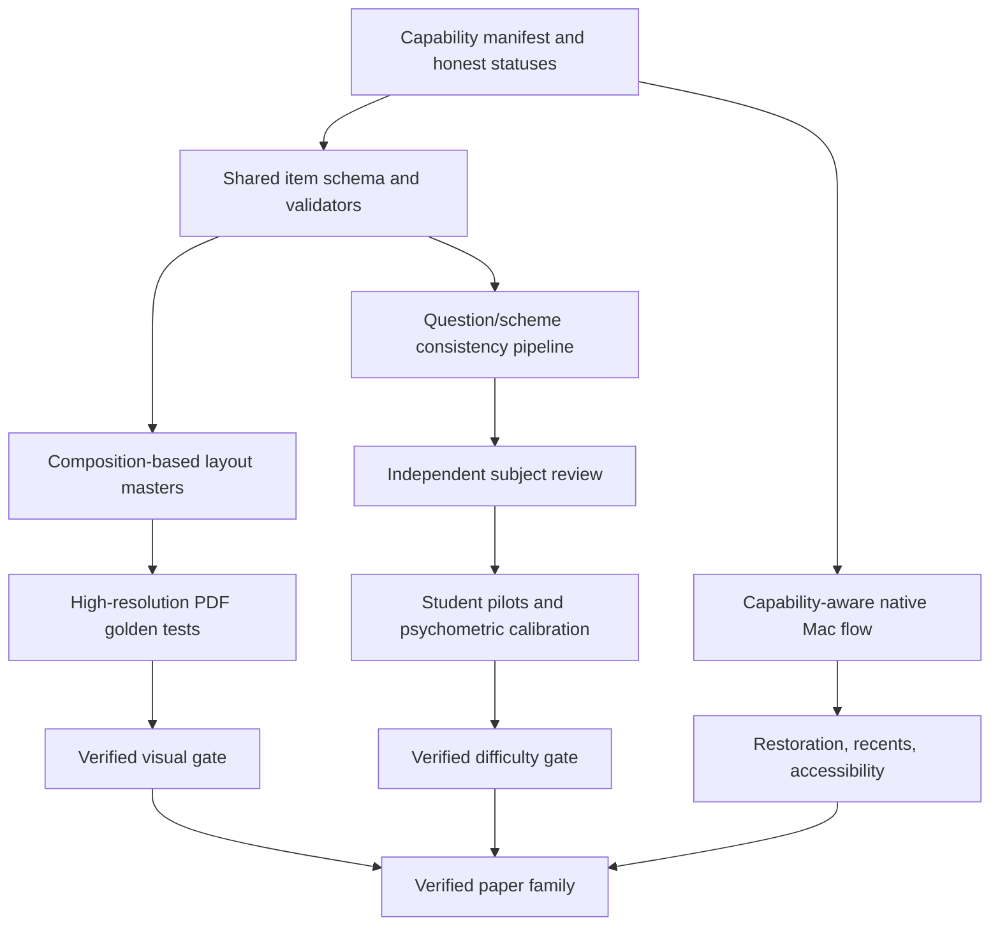

# Improvement roadmap

This roadmap converts the analysis into measurable work. Priorities are ordered
by risk to assessment validity and product trust, not by implementation size.

## Implementation status — 29 July 2026

The current engineering pass completed the software work for the following
items:

- completed: canonical generator registry, registry-driven dispatch/build,
  truthful provider UI, protocol v2 handshake, transactional publication,
  package manifests, PDF release validation, controlled table fonts, persistent
  recents, native Settings/menu behavior, frozen assessment metadata,
  AO/time/demand checks, mark-scheme DSL, mark traceability, shared AQA/OCR
  composition primitives, page-role alignment, registered/masked visual audit,
  exact-form calibration tooling, and independent AI review;
- continuously improvable: reference distributions, licensed/metric-compatible
  font coverage, subject-specific executable answer checking, and richer
  composition masters as additional official series are measured;
- externally blocked by evidence rather than code: empirical difficulty,
  equating, DIF analysis, student timing, and marker agreement.

The implementation evidence and remaining boundary are recorded in
`IMPLEMENTATION_AND_FIDELITY_REPORT.md`.

## P0: make capability and evidence truthful

### 1. One generator manifest

Replace the registry/CLI/dispatch/PyInstaller duplication with one validated
manifest and a generator protocol.

Each generator should declare:

- stable family and paper IDs;
- importable entry point;
- supported content modes and providers;
- required resources;
- produced document roles;
- blueprint/specification versions;
- visual, content-review, difficulty, and release gates;
- dry-run and cancellation support.

The CLI, Swift catalogue, packaging script, coverage matrix, and tests should be
generated from or validate against the same manifest.

Acceptance criteria:

- adding a sample generator requires no edit to `handle_generate`;
- build fails if a declared entry point/resource is missing;
- app never offers a provider that a selected generator ignores;
- advertised papers and backend CLI choices are exactly equal.

### 2. Separate “implemented” from “verified”

Keep every `difficulty: false` result visible in internal diagnostics and avoid
language implying parity. A release gate may mean operational readiness, but a
verification badge must require every defined evidence gate.

Acceptance criteria:

- readiness definitions are documented in-app and in the registry schema;
- no paper is marked verified without dated evidence and reviewer identity;
- gate overrides require an auditable rationale;
- the UI can distinguish built-in preview, implemented, calibrated, and verified.

### 3. Freeze the blueprint before generative work

Adopt one assessment-item schema for every family:

```text
Paper
 ├─ specification/profile version
 ├─ sections, options, totals, timing
 ├─ items
 │   ├─ syllabus outcomes and assessment objectives
 │   ├─ command word, intended demand, expected time
 │   ├─ prompt, source references, diagrams, answer space
 │   ├─ marks and mark dependencies
 │   └─ scheme, acceptable alternatives, exemplar responses
 └─ validation and provenance
```

The model may fill approved fields but must not change totals, choices, numbering,
AO allocation, or paper structure.

Acceptance criteria:

- JSON Schema or typed-model validation on every AI response;
- marks and AO allocations reconcile before rendering;
- invalid output is repaired within a bounded retry budget or fails clearly;
- deterministic seeds reproduce the same blueprint independently of provider.

### 4. Prove question/scheme consistency

Run multiple independent checks before a PDF can be released:

1. generate the item;
2. generate its scheme from the item model;
3. independently solve it without the scheme;
4. compare solution and scheme;
5. run subject-specific validators;
6. ask a critic to find ambiguity, hidden assumptions, leakage, or multiple
   defensible interpretations;
7. route uncertain items to human review.

For numerical subjects, use executable/symbolic checking where possible. For
essay subjects, validate that indicative content, levels, AO balance, and source
application are question-specific.

Acceptance criteria:

- every mark is traceable to an answer element or level decision;
- calculation answers include tolerances, units, follow-through, and method marks;
- option questions are comparable in demand and timing;
- source-dependent scheme points cite the exact source fact or inference;
- no generic syllabus bullet is inserted unless it answers the actual question.

## P0: visual fidelity

### 5. Turn layout masters into composition masters

Do not merely repair page boxes after rendering. Define reusable board-specific
layout primitives:

- physical boxes and printer-safe margins;
- header/footer anchors;
- page-number and “turn over” positions;
- question-number, part-label, and mark-column grids;
- baseline grid, line height, paragraph spacing, and answer-line rhythm;
- table, chart, diagram, source, formula, and continuation-page regions;
- orphan/widow and keep-with-next rules;
- front/back/blank-page variants.

Render content into those primitives, then compare the result against the same
master.

Acceptance criteria:

- all output roles enforce expected page sequence and allowed page-count range;
- key anchors remain within a sub-millimetre tolerance;
- content overflow is detected before PDF finalization;
- layout does not depend on string-length guesses;
- every document is tested at 100% print scale.

### 6. Use controlled fonts and metrics

System-font fallbacks cannot guarantee exam-paper metrics. Establish the exact
font policy for each board/profile:

- identify the actual face, weight, optical size, and feature settings;
- license and embed it where permitted, or choose a documented
  metric-compatible alternative;
- verify embedding, subsetting, glyph coverage, and substitution;
- record glyph widths, x-height, cap height, baseline, and line-height profiles;
- test all symbols needed by economics, accounting, and computer science.

Acceptance criteria:

- CI fails on font substitution;
- PDF inspection proves expected embedded fonts;
- measured line wraps match approved references in fixed text;
- math, currency, pseudocode, and phonetic/special glyphs have no fallback drift.

### 7. Upgrade the fidelity audit

Keep the existing numeric score, but add:

- 300–600 DPI page rasterization;
- page alignment and registration before comparison;
- structural similarity/perceptual difference;
- edge and baseline displacement;
- connected-component comparison for rules, boxes, marks, and diagrams;
- masked variable-content regions;
- per-region thresholds instead of one average;
- page-sequence alignment;
- explicit drawing/image/ink weights;
- output-role-specific thresholds;
- reference distributions across multiple years.

Acceptance criteria:

- a 1 mm shift in a mark column reliably fails;
- a changed font with similar family name reliably fails;
- expected variable question text does not dominate the score;
- page-level failures identify a region and actionable cause;
- golden fixtures run in CI and produce inspectable diff images.

### 8. Validate print and PDF behavior

Add checks for:

- media/crop/trim/bleed boxes;
- embedded fonts and image DPI;
- monochrome/grayscale legibility;
- thin-rule survival on common printers;
- PDF metadata and deterministic naming;
- no accidental annotations or hidden reference content;
- reading order and accessible document structure where feasible;
- duplex blank-page behavior.

## P0/P1: assessment quality and difficulty

### 9. Build a specification knowledge model

Convert flat syllabus lists into a versioned graph:

- subject concepts and prerequisites;
- learning outcomes;
- assessment objectives;
- permissible contexts;
- required mathematical/programming techniques;
- common misconceptions;
- command words and expected response forms;
- exclusions and specification-year changes.

Every generated item should carry explicit links to this model. Coverage should be
measured by outcome and AO, not keyword occurrence.

### 10. Constrain paper-level assessment design

Use a constraint solver for:

- exact total marks and section totals;
- board-specific AO percentages with tolerances;
- command-word and item-style distribution;
- topic breadth and controlled synopticity;
- difficulty/demand bands;
- estimated time;
- dependencies between subparts;
- option parity;
- source/data/diagram balance;
- avoidance of recently used or semantically duplicate items.

Fail closed if no valid form can be assembled.

### 11. Make mark schemes examiner-usable

Replace generic enrichment with a board-specific marking DSL that can express:

- exact marking points;
- alternative answers and equivalence classes;
- “allow,” “accept,” “do not accept,” and “ignore” guidance;
- method, accuracy, independent, and follow-through marks;
- dependencies and caps;
- levels-based descriptors and best-fit rules;
- AO allocation per point/level;
- source application;
- indicative content that is neither exhaustive nor generic;
- annotated exemplar responses at boundaries.

Measure inter-rater agreement using trained markers. Review wording that produces
low agreement.

### 12. Calibrate actual difficulty

Use intended demand only as a pretest filter. Actual calibration needs student
response data.

Recommended staged design:

1. expert Angoff/bookmark estimate;
2. small cognitive-lab review for interpretation and timing;
3. pilot with a representative sample;
4. classical item analysis;
5. Rasch/1PL or 2PL/partial-credit modelling as appropriate;
6. differential item-functioning checks;
7. equating to anchor/reference items;
8. revise or retire unstable items;
9. publish uncertainty and sample information with the calibration record.

Acceptance criteria should be defined per item type, but at minimum include target
facility bands, positive discrimination, acceptable fit, completion-time range,
and no material subgroup bias.

### 13. Create an item bank and exposure controls

Store item fingerprints, topic/AO metadata, calibrated parameters, usage history,
review status, and known issues. Use semantic similarity and structure hashes to
prevent near duplicates across seeds and providers.

Never train or prompt from copyrighted reference wording. Keep numeric profiles
and independently authored style rules separate from protected paper content.

## P1: backend and repository architecture

### 14. Introduce a generator plugin API

Suggested boundaries:

```text
GeneratorPlugin
 ├─ capabilities()
 ├─ build_blueprint(request)
 ├─ generate_content(blueprint, provider)
 ├─ validate(package)
 ├─ render(package, layout_profile)
 └─ evidence()
```

Load entry points from the manifest. Move shared orchestration, schemas,
validation results, events, and provider adapters into `Backend/Core`.

Keep board-specific policy inside the plugin:

- blueprint rules;
- syllabus/specification;
- question templates;
- marking DSL;
- visual profile;
- subject validators.

### 15. Split the Swift state owner

Refactor `AppViewModel` into focused observable services:

- `SelectionModel`;
- `GenerationController`;
- `ProviderSettings`;
- `RecentDocumentsStore`;
- `BenchmarkController`;
- `ConsentController`.

Keep one presentation model for the workspace, but avoid one object owning every
side effect. This will make state restoration and UI tests much easier.

### 16. Version the bridge protocol

Add a schema and initial handshake:

```json
{"protocol": 2, "backendVersion": "...", "capabilities": ["cancel", "eta", "manifest"]}
```

Every event should include a job ID, event ID, stage, timestamp, and optional
structured error code. Swift and Python should validate fixtures generated from
the same schema.

### 17. Make output transactional and reproducible

Generate into a unique temporary job directory. On success:

1. validate every expected file;
2. write a package manifest;
3. atomically publish/move the complete set;
4. emit one package-complete event.

Manifest fields should include:

- app/backend/generator version and Git commit;
- subject, board, specification, paper profile;
- seed;
- provider/model and non-secret inference settings;
- prompt/schema/validator versions;
- reference-layout profile;
- hashes of source data and outputs;
- gate results and warnings.

### 18. Harden provider adapters

Add bounded exponential backoff, rate-limit interpretation, retryable/nonretryable
errors, cancellation-aware requests, response-size limits, schema-first parsing,
token and estimated-cost reporting, structured redaction, and provider test
fixtures.

Do not send full specification/reference context if a minimal derived context is
sufficient. Display exactly what category of content leaves the Mac.

### 19. Strengthen dependency and build discipline

- Use one supported Python version in local builds and CI.
- Lock backend and generator dependencies with hashes.
- Validate every generator wheel/install in a clean environment.
- Generate PyInstaller hidden imports/data from the manifest.
- Run static type checks, lint, unit, integration, PDF golden, and Swift tests.
- Cache reference-derived numeric profiles, never the ignored source PDFs.
- Add a release job that refuses uncommitted generated registry changes.

The clean-environment packaging defect found during this audit was fixed by
limiting Edexcel package discovery to `pastpapergen*`; retain a clean-install
test so it cannot regress.

## P1: macOS information architecture and interaction

### 20. Make the sidebar a true source list

- Keep the selected subject expanded and visible.
- Persist expansion state.
- Collapse automatically when the window becomes too narrow.
- Do not expose a selectable “A level” label if it has no action.
- Keep critical progress in the detail/toolbar, not at the bottom.
- Consider a small filter only when subject coverage becomes large.

### 21. Turn creation into one coherent flow

The primary workspace should show, in order:

1. subject/board;
2. paper;
3. generation mode/provider capability;
4. output destination;
5. validation/readiness;
6. Create action.

First-use onboarding should be optional and interactive: either guide the user
through these actual controls or disappear. It should never mask an already
triggered action. Add an automated UI test for first launch → Create → dismiss/
continue → exactly one generation.

### 22. Use standard Mac commands

- Command-N: create a new paper/configuration or focus the creation workspace.
- Command-Return: perform the default Create action when appropriate.
- Command-Period: cancel.
- Preserve Command-G for Find Next if the app gains search.
- Use “Create Paper” consistently in buttons, menus, progress, help, and
  accessibility labels.
- Ensure every toolbar item has a menu equivalent.

### 23. Simplify the running state

Use one determinate progress area in the detail view and one cancel action in the
toolbar or progress area. It should show:

- current stage;
- completed/total items when meaningful;
- percentage;
- ETA only with an uncertainty-aware estimate;
- whether work is local or hosted;
- safe close/background behavior.

### 24. Implement real recents and document affordances

Persist security-scoped bookmarks and metadata for completed packages. Show:

- subject/board/paper/date;
- question paper, mark scheme, and supporting documents as one package;
- Quick Look preview/thumbnail;
- Open, Reveal, Regenerate with same blueprint, and Remove from Recents;
- missing/moved-file state.

If persistence is not implemented, rename the panel to “Generated documents.”

### 25. Restore windows and selection

Remove unconditional restoration disabling. Restore window size/position,
selected board/paper, sidebar expansion, and last Settings pane where safe. Do
not restore an in-progress subprocess as though it were still running; instead
show the last job's interrupted state.

Reduce the minimum size and use adaptive layout. Test compact widths, very large
windows, and multiple displays.

### 26. Make Settings consistent

Use pane-specific titles or “Paper creator Settings,” remember the active pane,
and adopt one persistence model:

- immediate changes with no Save button; or
- local draft with Apply/Cancel across the whole pane.

Provider capability should be contextual to the selected generator. Disable or
explain unsupported choices before a user enters credentials.

### 27. Complete the accessibility pass

Test with:

- Accessibility Inspector audit;
- VoiceOver from sidebar to output;
- Full Keyboard Access;
- Increase Contrast and Differentiate Without Color;
- reduced motion;
- text scaling and 10–13 pt minimums;
- long localized labels;
- light/dark appearances;
- 4.5:1 contrast for normal text and 3:1 for large/bold text.

PDF accessibility is a separate workstream from app accessibility and should
have its own declared target.

## P2: high-leverage product improvements

- Package templates/favourites for common subject/paper/provider combinations.
- Batch generation only after job isolation and cost controls are robust.
- Side-by-side question-paper/mark-scheme preview with synchronized item
  navigation.
- Validation inspector showing marks, AO mix, topics, demand, warnings, and
  evidence before export.
- Human review workflow with comments, approval, and item retirement.
- Export a compact machine-readable assessment package alongside PDFs.
- Local item-bank search and similarity warnings.
- Release notes that distinguish new coverage from newly verified coverage.

## Recommended delivery sequence



The first release milestone should not be “more subjects.” It should be one
paper family with a complete vertical evidence chain: frozen blueprint,
question-specific scheme, independent review, high-resolution visual gate,
student pilot, accessible native flow, and reproducible package manifest. Once
that system exists, expanding to other families becomes controlled replication
rather than seven parallel experiments.
