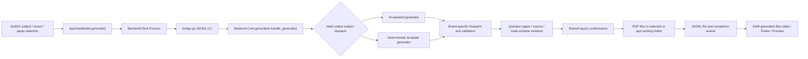
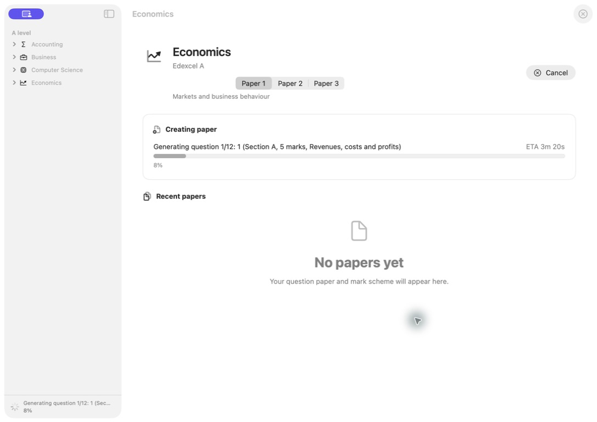

# Paper creator: deep project analysis

Date: 29 July 2026

## Executive assessment

Paper creator is a native macOS front end over a Python document-generation
platform. Its core product promise is not merely “ask an LLM for questions”; it
is to produce a coordinated assessment package whose structure, typography,
pagination, source material, mark allocation, and marking guidance resemble a
specific A-level exam-board paper.

The project already has unusually strong foundations for that promise:

- a native SwiftUI shell rather than a wrapped website;
- a machine-readable catalogue and readiness registry;
- board- and paper-specific blueprints;
- deterministic seeds and dry-run generation;
- dedicated PDF renderers and mark schemes;
- reference-corpus profiling, layout conformance, and visual-fidelity tooling;
- privacy-conscious provider handling and Keychain storage;
- backend integration, blueprint, calibration, layout, and corpus tests.

The most important conclusion is that the product promise is currently ahead of
the evidence:

1. All 18 advertised paper variants have `difficulty: false`.
2. Five of the seven advertised subject/board families do not currently use the
   AI provider selected in the app.
3. The coverage matrix reports 105 profiled families, seven implemented, and
   zero verified.
4. The runtime layout-conformance step uses page boxes but not the richer
   text/drawing/image coordinates represented by the layout-master model.
5. Shared mark-scheme enrichment is structurally useful but too generic to be
   considered examiner-authentic.
6. The fidelity score is helpful for regression detection, but is too coarse to
   establish “looks identical” by itself.

The honest present-day positioning is therefore:

> A sophisticated generator of unofficial, structurally exam-like A-level
> practice papers, with varying generation methods and incomplete independent
> equivalence evidence.

“Identical to real papers” should remain an internal quality target, not a
publicly implied verified claim, until the proposed evidence gates are passed.

## Purpose and product boundary

The program turns four user decisions into a set of PDFs:

1. subject and exam board;
2. paper number;
3. generation engine/model;
4. output folder.

The output normally includes a question paper and mark scheme, and may include a
source booklet or other paper-specific supporting document. The app is explicitly
unofficial and unaffiliated with Pearson, Edexcel, AQA, or OCR.

The product has four interacting responsibilities:

| Responsibility | What it must guarantee |
| --- | --- |
| Assessment design | Correct specification coverage, command words, assessment objectives, marks, timing, cognitive demand, and option rules |
| Content generation | Novel, coherent, solvable questions and source material with no contradictions or leakage |
| Marking design | Question-specific creditworthy points, acceptable alternatives, level descriptors, AO allocation, calculations, and internal consistency |
| Document production | Board-like page geometry, typography, whitespace, numbering, marks, diagrams, instructions, headers, footers, and pagination |

Failure in any one layer breaks the promise even if the other three are strong.
A visually exact paper with weak assessment design is not a faithful paper; a
well-written question in the wrong typography and pagination is not either.

## End-to-end runtime



### 1. Catalogue and selection

`macOS/PaperCreator/AppModels.swift` and the runtime resources load subject and
board metadata. `macOS/PaperCreator/AppConfiguration.swift` joins the broad
catalogue with `Resources/generator-registry.json`, so only advertised generator
families are shown as ready.

The catalogue contains more aspirational coverage than the UI exposes. The
coverage matrix profiles 105 families across three boards, but the registry
advertises seven implemented families. This separation is sensible: profiling a
reference is not the same as implementing or verifying a generator.

### 2. Swift state and command construction

`macOS/PaperCreator/AppViewModel.swift` owns the selected board, paper, provider,
model, output location, consent state, generation progress, and output files.
When generation starts it:

- validates a `generationBlocker`;
- asks for hosted-AI consent when required;
- persists preferences;
- clears the in-memory output list and progress log;
- selects the direct output folder or an App Store working folder;
- constructs a CLI command with subject, paper, provider, model, Ollama URL, and
  optional `--dry-run`;
- passes the generation date and hosted API key through environment variables;
- launches the backend and converts JSONL events into UI state.

Hosted API keys do not appear in command-line arguments and are stored in
Keychain. That is a sound design because process arguments can be discoverable
by other local tooling.

### 3. Process bridge and event protocol

`macOS/PaperCreator/BackendClient.swift` launches either:

- the PyInstaller backend inside the app bundle; or
- the development Python interpreter and `bridge.py`.

Standard output is a line-delimited JSON protocol. Events include status,
progress, models, generated files, errors, and completion. Standard error is
captured and converted into an actionable failure. Cancellation terminates the
child process.

The JSONL boundary is a good architectural seam:

- Swift does not import Python or need an embedded interpreter API;
- backend generation can be exercised independently from the UI;
- progress is streamable;
- the packaged executable and development bridge share the same contract.

Its current weakness is that the protocol is implicit rather than versioned.
There is no declared protocol version, capability handshake, job identifier, or
schema file shared by Swift and Python.

### 4. Backend validation and dispatch

`Backend/Core/cli.py` declares seven backend subject identifiers.
`Backend/Core/generation.py` validates the output directory, model, API key, and
then selects one of seven generator functions through a hard-coded conditional
chain.

Each wrapper:

1. adjusts `sys.path` for its generator package;
2. imports that package's `generate_package`;
3. emits an initial progress event;
4. invokes the board-specific generator;
5. runs shared layout conformance;
6. emits each generated file and a completion event.

The same list of generators is also represented in the registry and the
PyInstaller build script. This three-way duplication is a maintenance risk:
adding a generator can update the UI but not the backend, or the backend but not
the bundle.

### 5. Two different generation architectures

The UI presents one global AI-provider choice, but the backend has two materially
different pipelines:

| Family | Papers | Current content pipeline | Selected provider used? |
| --- | ---: | --- | --- |
| AQA Accounting | 1–2 | Seeded board-specific construction | No |
| AQA Business | 1–3 | Seeded board-specific construction | No |
| AQA Computer Science | 1–2 | AI-assisted package generation | Yes |
| OCR Computer Science | 1–2 | Seeded board-specific construction | No |
| AQA Economics | 1–3 | Seeded board-specific construction | No |
| Pearson Edexcel Economics A | 1–3 | AI-assisted package generation | Yes |
| OCR Economics | 1–3 | Seeded board-specific construction | No |

The deterministic families are not necessarily inferior: a constrained template
can be more reliable than an unconstrained LLM. The problem is product truth.
For five families, changing from Ollama to OpenAI or Anthropic does not change the
generated question pipeline, although the UI implies that it will.

The registry should declare generator capabilities such as:

```json
{
  "content_mode": "deterministic",
  "supported_providers": [],
  "produces": ["question_paper", "mark_scheme", "source_booklet"],
  "empirical_difficulty_verified": false
}
```

The UI and backend should both consume that declaration.

### 6. Blueprint construction

Each generator package owns paper-specific configuration, syllabus data,
question types, a generator, a renderer, and tests. Blueprints constrain:

- paper sections and ordering;
- number and style of questions;
- mark values and mark breakdowns;
- optional or mutually exclusive questions;
- source/stimulus types;
- topic selection;
- paper totals;
- renderer behavior.

This is the right high-level design. A faithful assessment should be generated
inside a frozen blueprint, not have its structure improvised by an LLM.

Edexcel Economics is the clearest example: the blueprint establishes the exact
mark/style skeleton, selects topics and contexts from a seed, and then asks the
model to rewrite individual questions. Validators can reject invalid output and
fall back to deterministic content. That pattern should be generalized.

At present the packages duplicate substantial plumbing (`cli`, configuration
loading, generation orchestration, renderer entry points, and tests). The
duplication makes board customization easy in the short term, but makes shared
quality improvements expensive and inconsistent.

### 7. Provider behavior

`Backend/Core/providers.py` supports:

- Ollama through generator-local clients;
- OpenAI Responses API;
- Anthropic Messages API;
- Apple MLX local inference.

Hosted responses are requested as JSON, then recovered by extracting the first
outer JSON object if needed. Network requests have a 180-second timeout. There is
no shared exponential backoff, rate-limit handling, retry budget, idempotency
strategy, token/cost accounting, or provider-level schema validation.

The parser checks that a JSON object exists, but correctness is enforced later
and varies between generator packages. A shared typed schema should be the first
line of defense, followed by semantic validators.

### 8. Rendering and layout conformance

Board-specific ReportLab/PDF renderers create the documents. The shared
`Backend/Core/layout_master.py` data model can represent:

- page boxes;
- text lines and content boxes;
- drawing and image regions;
- fixed text slots;
- page-level layout information.

However, `Backend/Core/layout_conformance.py` currently applies the supported
page-box masters after generation. It does not reconstruct pages against the
richer positional master, and strict page-count conformance is applied to the
question paper but not consistently to mark schemes and source booklets.

This explains an important limit: the project can normalize paper size and some
macro geometry without guaranteeing exact typographic placement.

### 9. Mark-scheme construction

`Backend/Core/mark_scheme_enrichment.py` enriches generator output with syllabus
points, AO phrases, marker notes, and level bands based largely on marks and
subject. It is useful as a completeness guard, but it is generic. Rotating
syllabus points and standard AO wording cannot establish that a specific answer
is:

- sufficient for the awarded mark;
- the only or an acceptable alternative answer;
- correctly linked to a calculation or diagram;
- internally consistent with a source;
- representative of a real examiner's tolerance;
- calibrated to a board-specific level descriptor.

Mark schemes should be generated from the same item model as the question and
then independently solved and reviewed. Question and scheme are not separate
documents; they are two projections of one assessment item.

### 10. Completion and file handling

The backend emits file roles and paths. The app can open or reveal the latest
question paper and mark scheme. In App Store distribution it stages files in an
allowed working location and subsequently moves them to the chosen folder.

The main workspace labels its table “Recent papers,” but `generatedFiles` is
in-memory and cleared at the start of each generation and when a board changes.
It is therefore a “current run” table, not a durable recent-document history.

## Current support and readiness

There are 18 advertised paper variants. Registry gates show:

- 18/18: blueprint, syllabus, question types, mark distribution, unique content,
  renderer, mark scheme, runtime, and release;
- 14/18: visual;
- 0/18: difficulty;
- 0 verified families in the coverage matrix.

The four visual failures are AQA Computer Science Paper 2 and all three Edexcel
Economics papers, plus the registry data should be rechecked whenever gates
change. `release: true` currently means runnable/releasable, not independently
equivalent.

This vocabulary should be made explicit:

| Status | Proposed meaning |
| --- | --- |
| Profiled | Official references and specification metadata exist |
| Implemented | Generator runs and produces structurally valid documents |
| Visually calibrated | Per-page fidelity thresholds pass against approved masters |
| Content reviewed | Independent subject experts approve a statistically meaningful sample |
| Difficulty calibrated | Student-trial evidence meets declared facility/discrimination targets |
| Verified | All required visual, content, marking, accessibility, and difficulty gates pass |

## Fidelity system: strengths and limits

`tools/paper_fidelity_audit.py` is a strong regression foundation. It compares
page counts, word counts, printed mark sequences, margins, common font
families/sizes, graphics density, page boxes, low-resolution placement grids, and
content envelopes. Render placement receives the largest score weight.

The audit is not yet an equivalence test:

- pages are paired by sequence, so one inserted or removed page can distort all
  following comparisons;
- grids are only 96 × 136 and cannot resolve baselines, rule thickness, glyph
  width, or small mark-box shifts;
- font-family normalization and top-size summaries do not prove that the same
  font metrics were used;
- drawing, image, and ink placement have zero final weight;
- reference variability across years is not modelled explicitly;
- there is no print-resolution perceptual comparison or masked region comparison;
- reading order, PDF tagging, colour space, font embedding, overprint, and
  printer margins are outside the score;
- page-count enforcement is not equally strict for every output role.

The result is best interpreted as “this build did not materially drift from the
numeric reference profile,” not “a human cannot distinguish the papers.”

## Difficulty and assessment validity

The calibration modules verify useful structural properties such as:

- printed mark sequence;
- total/page structure;
- source length;
- seed uniqueness;
- syllabus coverage;
- broad demand mix.

The calibration data itself correctly states that these are not psychometric
equivalence claims. Independent subject review, student trials, and
psychometric-equivalence gates are false.

Difficulty cannot be proved from marks, command verbs, word count, or an LLM
self-rating. Those features describe intended demand. Actual difficulty requires
response data:

- item facility;
- discrimination;
- distractor behavior where applicable;
- partial-credit category behavior;
- completion time;
- differential item functioning;
- reliability and information across the ability range;
- equating to a stable reference form.

Until then, the system should say “designed to a target demand profile,” not
“equivalent difficulty.”

## macOS user-experience audit

The audit used the running production-style build, three screenshots, source
inspection, and the current Apple Human Interface Guidelines. The Settings
window could not be captured after the UI automation connection failed, so its
findings are source-based. This was not a full VoiceOver, Accessibility Inspector,
contrast, localization, or reduced-motion audit.

### What is already Apple-like

- Native `NavigationSplitView`, `List`, `Form`, `TabView`, `Picker`,
  `ProgressView`, sheets, alerts, tables, and Settings scene.
- System colors, SF Symbols, and system typography.
- Clear large-title hierarchy and restrained visual styling.
- Determinate progress with an ETA when measurable.
- Standard Command-Period cancellation.
- Keychain-backed credentials and explicit hosted-AI disclosure.
- Accessibility labels/help on important controls.
- Menu commands for files, diagnostics, benchmark, and help.

### Observed workspace


The workspace is calm and legible, but the collapsed subject groups hide the
current board even while its detail is visible. The minimum 1120 × 740 frame
makes the app less adaptable than a typical Mac utility. The large empty
“Recent papers” panel has little value before a run.

### Observed first-use sheet


The sheet is visually native and scoped. Its text says the user will choose a
subject, paper, and model, but the sheet does not let them make those choices.
It teaches concepts rather than completing a first paper. During this audit,
activating Create Paper around the first-use presentation appeared capable of
starting generation as the sheet was dismissed; that sequence needs a focused
UI test before being treated as a confirmed defect.

### Observed generation state



Progress appears in the content and again at the bottom of the sidebar. Cancel
appears in the workspace and toolbar. The duplication adds noise and creates
uncertainty about the primary control. One progress surface and one prominent
cancel action are sufficient.

### HIG-specific findings

1. `PaperCreatorApp` disables state restoration. Apple recommends launching
   quickly and restoring previous state where appropriate.
2. Command-G is assigned to “Generate Paper,” but Command-G is the conventional
   “Find Next” shortcut. New-document behavior should use Command-N; cancellation
   should remain Command-Period.
3. The command says “Generate Paper,” the primary button says “Create Paper,”
   progress says “Creating paper,” and help mixes both verbs. One vocabulary
   should be used everywhere.
4. The sidebar puts live status at its bottom. Apple advises against placing
   critical actions or information at the bottom of a sidebar.
5. The fixed minimum window size and sidebar minimum reduce graceful collapse at
   narrow widths.
6. Settings has three tabs but a generic “Settings” navigation title. A custom
   settings window should identify the active pane or use “Paper creator
   Settings,” remember the last pane, and avoid enabled minimize/zoom controls.
7. AI settings uses an explicit Save button, while several other settings persist
   immediately. The transaction model is inconsistent.
8. “Recent papers” does not persist recent documents, contrary to the label.
9. The global provider selection is misleading for deterministic generator
   families.
10. Every toolbar action should also exist in the menu bar; this should be kept
    as new toolbar actions are added.
11. Full Keyboard Access, VoiceOver reading order, increased contrast, larger
    text, localization expansion, and reduced motion need automated and manual
    validation.

Relevant current Apple guidance:

- [Human Interface Guidelines](https://developer.apple.com/design/human-interface-guidelines/)
- [Designing for macOS](https://developer.apple.com/design/human-interface-guidelines/designing-for-macos)
- [Sidebars](https://developer.apple.com/design/human-interface-guidelines/sidebars)
- [Settings](https://developer.apple.com/design/human-interface-guidelines/settings)
- [Onboarding](https://developer.apple.com/design/human-interface-guidelines/onboarding)
- [Launching](https://developer.apple.com/design/human-interface-guidelines/launching)
- [Keyboards](https://developer.apple.com/design/human-interface-guidelines/keyboards)
- [Menus](https://developer.apple.com/design/human-interface-guidelines/menus)
- [Toolbars](https://developer.apple.com/design/human-interface-guidelines/toolbars)
- [Progress indicators](https://developer.apple.com/design/human-interface-guidelines/progress-indicators)
- [Typography](https://developer.apple.com/design/human-interface-guidelines/typography)
- [Accessibility](https://developer.apple.com/design/human-interface-guidelines/accessibility)

## Structural assessment

### Strong seams

- Swift/Python separation through JSONL.
- Core path and event utilities shared by generators.
- Registry-driven UI exposure.
- Per-board data isolation.
- Deterministic seeds and dry-run behavior.
- Explicit conformance step after rendering.
- Separate corpus/profiling tooling from shipped reference content.

### Architectural pressure points

1. **Central dispatch hotspot.** `handle_generate` knows every generator.
2. **Broad Swift state owner.** `AppViewModel` handles selection, preferences,
   credentials, consent, process lifecycle, ETA, notifications, files, benchmark,
   diagnostics, and UI presentation.
3. **Parallel generator frameworks.** Seven packages repeat infrastructure.
4. **Multiple sources of truth.** Registry, CLI choices, dispatch, packaging
   script, catalogue, and coverage matrix can diverge.
5. **Weak capability contract.** A generator cannot formally declare AI support,
   outputs, limits, or evidence status.
6. **Implicit event protocol.** No schema/version negotiation.
7. **Late layout normalization.** Page boxes are corrected after rendering rather
   than composing content into board-specific layout primitives.
8. **Generic mark-scheme enrichment.** Shared convenience risks homogenizing
   board-specific marking behavior.
9. **Non-atomic package creation.** Multi-file output needs a job manifest and
   final atomic publication so a cancellation cannot look complete.
10. **Packaging fragility.** A clean backend environment exposed automatic
    discovery of both `data` and `pastpapergen` in the Edexcel package. The local
    fix explicitly limits setuptools discovery to `pastpapergen*`.

## Graphify project map

Graphify 0.9.29 is installed through `uv`, and its Codex skill, hook
configuration, and project instructions are checked into this repository.

Generated artifacts:

- `graphify-out/graph.json` — queryable machine graph;
- `graphify-out/graph.html` — interactive network;
- `graphify-out/GRAPH_REPORT.md` — communities, hubs, and connections;
- `graphify-out/GRAPH_TREE.html` — filesystem/symbol tree;
- `graphify-out/Past-Paper-Creation-callflow.html` — Mermaid call-flow report;
- `graphify-out/manifest.json` — extraction manifest.

Extraction result:

| Measure | Result |
| --- | ---: |
| Source files tracked | 227 |
| Nodes | 2,199 |
| Edges | 6,695 |
| Communities | 116 |
| Missing/dangling/self/collapsed/duplicate edges | 0 |
| Extracted vs inferred edges | 94% / 6% |
| Estimated corpus tokens | 146,600 |
| Average graph query tokens | 13,709 |
| Estimated average reduction | 10.7× |

Most connected architectural nodes include `build_paper_blueprint`,
`load_builtin_paper_config`, `load_syllabus`, `GeneratedQuestion`,
`AppViewModel`, `GeneratedPaper`, and `render_question_paper`. This confirms that
blueprint/configuration construction, shared document models, rendering, and the
Swift state owner are the main change-amplification points.

Future agents should query the graph before opening broad source areas:

```bash
graphify query "How does the Swift UI produce a PDF?"
graphify query "Where is paper difficulty calibrated?"
graphify path "AppViewModel" "BackendClient"
graphify affected "build_paper_blueprint" --depth 2
graphify explain "conform_generated_documents"
```

The retained graph is deterministic AST analysis. A deep semantic pass over code,
documents, and images was attempted with the available local Ollama model, but
the model repeatedly returned malformed extraction JSON. It was not used to
pollute the final graph. Documents, screenshots, reference-corpus binaries, build
artifacts, virtual environments, and generated PDFs are covered by this written
map or intentionally ignored rather than represented as unreliable inferred
edges.

## What “excellent” should mean

The project reaches its target only when a generated package is simultaneously:

- **specification-valid:** every item maps to allowed content and assessment
  objectives;
- **structurally exact:** totals, sections, options, timing, source use, and mark
  positions match a declared paper profile;
- **content-valid:** independent solvers agree the paper is coherent and
  answerable;
- **markable:** trained markers reach acceptable agreement using only the scheme;
- **empirically calibrated:** student response data places items and the form in
  the intended difficulty range;
- **visually calibrated:** page-by-page typographic and positional thresholds pass
  against multiple official references;
- **accessible and native:** the Mac workflow supports keyboard, assistive
  technologies, state restoration, and standard platform behavior;
- **reproducible:** every output records generator version, model, prompt/schema
  version, seed, specification version, reference profile, and validation result.

The implementation roadmap for reaching those conditions is in
`docs/project-analysis/IMPROVEMENT_ROADMAP.md`.
