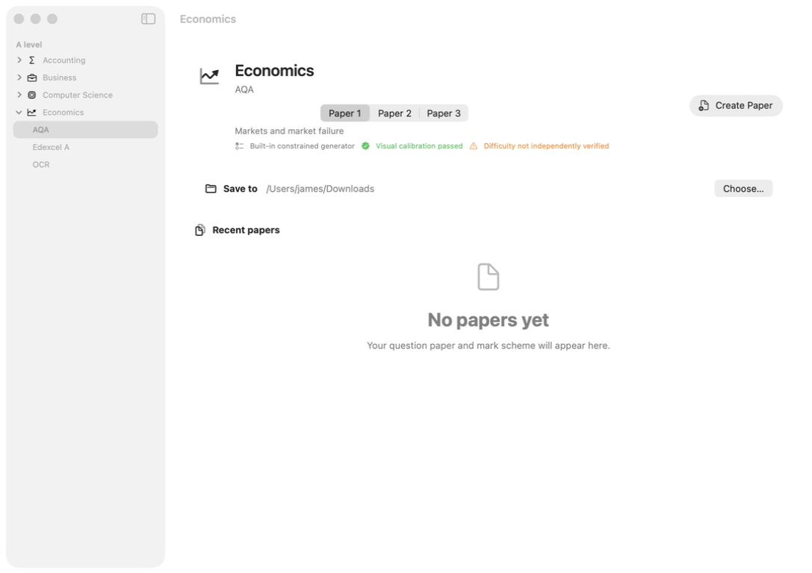
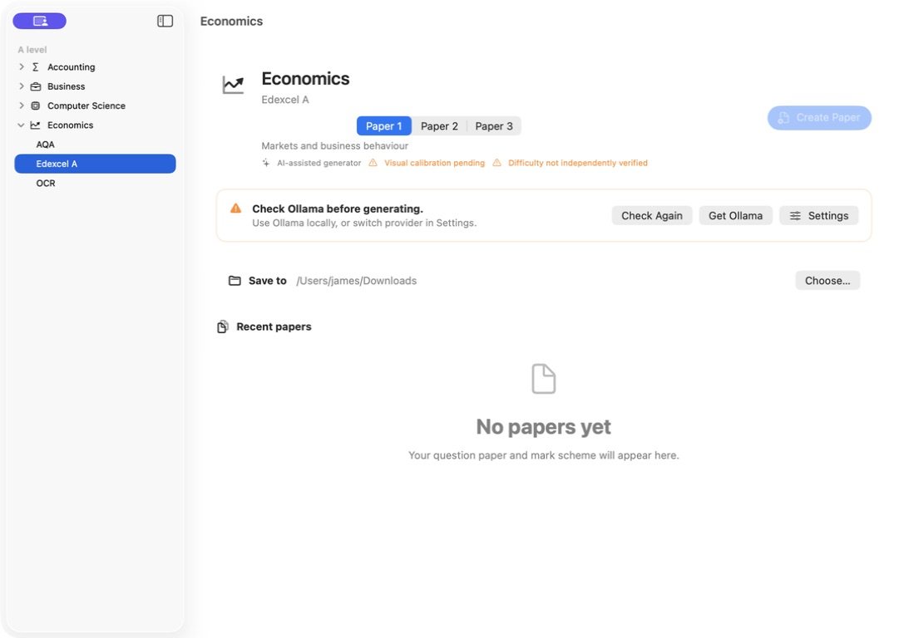

# macOS UI audit

Date: 29 July 2026

## Scope

Combined UX, screenshot, and accessibility-tree audit of the rebuilt macOS
app’s main paper-creation flow and its AI-unavailable state. The target is a
recognisably native, low-friction macOS workflow aligned with Apple’s current
guidance for sidebars, settings, toolbars, menus, and progress indicators.

## Step 1 — paper workspace

Health: **Good**

The checked-in image below records the pre-refactor baseline. The final
1087 × 768 audit capture is stored in the Codex visual audit output as
`full-implementation-audit/03-final-creation.jpeg`; a baseline/final comparison
is stored beside it as `00-baseline-vs-final.png`.

Confirmed strengths:

- native `NavigationSplitView` hierarchy with disclosure rows for subjects and
  board choices beneath the selected subject;
- segmented paper picker is close to the object it changes;
- one clear primary toolbar action, with cancellation occupying the same task
  location while generation is running;
- output location is visible in the task rather than hidden in Settings;
- blueprint, at-creation originality, visual-profile, and
  unverified-difficulty states are expressed in text as well as colour;
- the empty recent-papers state explains what will appear;
- the sidebar does not place critical status at its bottom edge.

Risks and improvements made:

- custom rounded panels and a duplicated in-content title/action row were
  replaced by native grouped form sections and toolbar actions;
- “Visual calibration passed” overstated the evidence; it is now “Visual
  profile reviewed”;
- originality previously appeared passed before a form existed; it now says “At
  creation” until a completed assessment package provides evidence;
- recent files previously disappeared between launches; metadata now persists
  and missing files can be removed from history.
- the action and status row could become crowded under large accessibility text;
  the window now has a practical minimum size, but enlarged-text and VoiceOver
  testing remain necessary.

## Step 2 — paper blocked on unavailable AI

Health: **Good**

Confirmed strengths:

- the primary action is disabled and its accessibility help states the exact
  blocker;
- the warning gives a plain-language recovery path;
- `Check Again`, `Get Ollama`, and `Settings` are available at the point of
  failure;
- local-vs-hosted generation is explicit for every family;
- warning meaning is not conveyed by colour alone.

Risks:

- the orange evidence text is small and should receive a contrast check in both
  appearances;
- three recovery actions in one banner are defensible but should be tested with
  first-time users to confirm that “Settings” is understood as the hosted/model
  route.

## Step 3 — Settings

Health: **Source- and test-verified; screenshot blocked**

Opening Settings or the separate Benchmark window caused the Computer Use
accessibility pipe to close before a valid screenshot could be saved. The app
process remained healthy after both transitions and the source rebuilt
successfully; this is therefore recorded as an audit-tool limitation, not as a
claim that those secondary windows were visually verified.

The implementation and native tests confirm:

- `⌘,` opens Settings through the app’s Settings scene;
- panes have stable toolbar navigation and a pane-specific window title;
- changes save immediately, with no redundant Save/Apply button;
- the last selected pane is restored;
- minimum/zoom controls are disabled for the fixed settings window;
- provider controls explain local versus hosted processing and Keychain storage.

## Apple HIG alignment

The changes follow the applicable official guidance:

- [Settings](https://developer.apple.com/design/human-interface-guidelines/settings):
  standard app-menu access, stable panes, immediate application, and task-local
  options kept out of Settings.
- [Sidebars](https://developer.apple.com/design/human-interface-guidelines/sidebars):
  disclosure hierarchy, adaptive sidebar visibility, and no critical content
  stranded at the bottom.
- [Progress indicators](https://developer.apple.com/design/human-interface-guidelines/progress-indicators):
  determinate progress when available, stable progress updates, and cancellation.
- [Designing for macOS](https://developer.apple.com/design/human-interface-guidelines/designing-for-macos/):
  keyboard commands, resizable windows, native controls, menu commands, and
  familiar sidebar/detail structure.

## Evidence limits

Screenshots cannot establish complete accessibility compliance. Before release,
test VoiceOver order and announcements, Full Keyboard Access, reduced motion,
Increase Contrast, light/dark appearances, 200% text, smallest supported window,
and long localised strings. The generation-success and cancellation states are
covered by code/tests but were not recaptured in this screenshot run.
