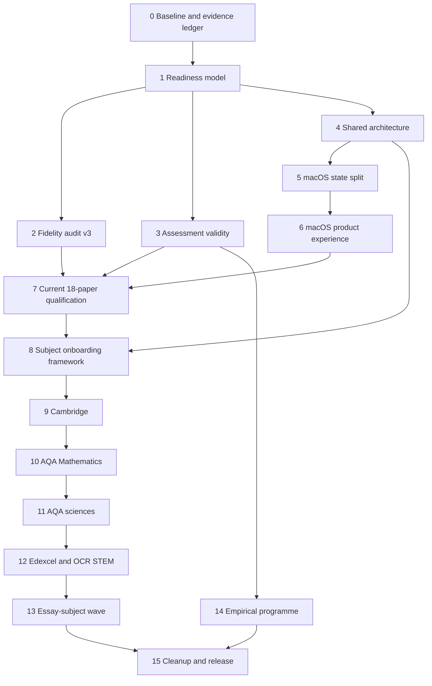

# Paper Creator Excellence Programme Implementation Plan

> **For agentic workers:** REQUIRED SUB-SKILL: Use superpowers:subagent-driven-development (recommended) or superpowers:executing-plans to implement this plan task-by-task. Steps use checkbox (`- [ ]`) syntax for tracking.

**Goal:** Deliver an extensible macOS application that generates original A-level assessment packages with board-calibrated structure and layout, independently defensible questions and mark schemes, truthful readiness evidence, and App Store-quality product behavior.

**Architecture:** Preserve the existing contract-first assessment pipeline, then separate qualification, rendering, subject plugins, and macOS coordinators behind versioned protocols. Qualification is evidence-based at three levels—engineering, visual, and empirical—and the registry remains the single capability source consumed by tools and the app.

**Tech Stack:** Python 3.11+, Pydantic 2, ReportLab, PyMuPDF, Pillow, pytest, Ruff, Swift 6, SwiftUI, AppKit/PDFKit/QuickLook/TipKit, XCTest, JSON Schema, XcodeGen, Graphify.

**Spec:** `docs/superpowers/specs/2026-08-26-paper-creator-excellence-programme-design.md`

## Global Constraints

- Generate original questions; never copy official question wording, logos, candidate data, or claim board endorsement.
- “Equivalent difficulty” and “fully calibrated” are prohibited until external evidence passes the empirical gate.
- Preserve all existing user changes and make small local commits on `main`; do not push until the user requests it.
- Begin every behavior change with a failing automated test and record manual evidence where automation cannot judge quality.
- Run `graphify update .` after source changes and commit its output with the corresponding task.
- Never commit official reference PDFs, generated papers, raster comparison pages, model files, secrets, personal student data, build products, or caches.
- Do not mark a family advertised until all required gates for its claimed readiness level pass.
- Re-run the affected family matrix after every renderer or assessment change; run the complete matrix at each phase gate.

## Programme Dependencies and Execution Order

Tasks 2, 3, and 5 may proceed in parallel after Task 1. A phase gate is not satisfied by passing tests alone; its evidence manifest must also be complete.

## Approved-Improvement Traceability

| Approved improvement | Implemented by tasks |
|---|---|
| Honest engineering, visual, and empirical readiness | 0, 1, 7, 14, 15 |
| 300/600-DPI, glyph, baseline, print, tagging, role, and multi-year fidelity | 2, 4, 7 |
| Question validity, demand, originality, independent solving, and balance | 3, 7, 14 |
| Complete mark schemes, alternatives, partial credit, response simulation, and marker agreement | 3, 7, 14 |
| Deterministic graphs, tables, mathematical/scientific diagrams, and visual data | 4, 9–13 |
| Shared renderer, capability schema, reproducibility, migration validation, and removal of family duplication | 0, 4, 8, 15 |
| App state decomposition, history, restoration, search, favourites, preview, onboarding, tutorial, and HIG/accessibility | 5, 6 |
| Adaptive Ollama recommendation, other-model warning, and consented plain-language MLX setup | 6, 15 |
| Current AQA Computer Science and Edexcel Economics visual gaps plus every-paper manual comparison | 7 |
| Cambridge, Mathematics, sciences, and later essay-subject expansion | 8–13 |
| Offline, low-storage, corrupt-cache, interruption, signing, sandbox, App Store, and clean-install assurance | 5, 6, 15 |
| Removal of unused files and durable clean-repository controls | 15 |

---

### Task 0: Freeze the Baseline and Create the Evidence Ledger

**Files:**
- Create: `Resources/qualification-schema.json`
- Create: `Resources/qualification-policy.json`
- Create: `Backend/Core/qualification/__init__.py`
- Create: `Backend/Core/qualification/manifest.py`
- Create: `tests/test_qualification_manifest.py`
- Modify: `tools/live_generation_matrix.py`
- Modify: `docs/ASSESSMENT_QUALITY.md`

**Interfaces:**
- `QualificationLevel = Literal["engineering", "visual", "empirical"]`
- `QualificationManifest.load(path: Path) -> QualificationManifest`
- `QualificationManifest.record_evidence(gate: str, evidence: EvidenceRecord) -> None`
- `QualificationManifest.is_qualified(level: QualificationLevel) -> bool`

- [x] Add schema tests requiring generator ID, paper ID, seed, provider/model, model digest when available, contract/blueprint/prompt/syllabus/renderer versions, artifact hashes, gate results, evidence paths, timestamps, reviewer identity class, and tool versions.
- [x] Run `PYTHONPATH=. .venv/bin/pytest -q tests/test_qualification_manifest.py` and confirm the module/schema absence fails.
- [x] Implement immutable Pydantic manifest models, canonical JSON serialization, SHA-256 artifact hashing, and explicit `not_run`, `passed`, `failed`, and `not_applicable` states.
- [x] Extend the live matrix to emit one manifest per paper plus an aggregate run manifest without embedding PDFs or private review data.
- [x] Capture a fresh baseline for all 18 papers using a fixed seed set, recording failures rather than silently resuming old artifacts.
- [x] Add the baseline counts and known false gates to `docs/ASSESSMENT_QUALITY.md`.
- [x] Run the focused tests, `PYTHONPATH=. .venv/bin/pytest -q tests/test_live_generation_matrix.py`, Ruff on changed Python, and `graphify update .`.
- [x] Commit as `Establish qualification evidence manifests`.

### Task 1: Replace Boolean Readiness with Three Truthful Levels

**Files:**
- Modify: `Resources/generator-registry.json`
- Modify: `Resources/backend-protocol.schema.json`
- Modify: `Backend/Core/generator_registry.py`
- Modify: `Backend/Core/generation.py`
- Modify: `tools/coverage_matrix.py`
- Modify: `tests/test_generator_registry.py`
- Modify: `tests/test_coverage_matrix.py`
- Modify: `tests/test_app_backend.py`
- Modify: `macOS/PaperCreator/Domain/AppModels.swift`
- Modify: `macOS/PaperCreator/Features/Generation/GeneratorWorkspaceView.swift`
- Modify: `macOS/Tests/AppTests.swift`

**Interfaces:**
- Registry paper field: `qualification: { engineering: GateState, visual: GateState, empirical: GateState }`
- Backend paper field: `qualificationLevels: { engineeringValidated: Bool, visuallyCalibrated: Bool, empiricallyCalibrated: Bool }`
- Swift: `struct QualificationReadiness: Codable, Equatable`

- [x] Add migration tests that hydrate the current gate booleans but never infer empirical readiness from model review or deterministic calibration files.
- [x] Run the registry, coverage, backend, and Swift model tests and verify the new fields are absent.
- [x] Add registry schema version 3 with three levels and evidence-manifest references; preserve detailed component gates under `checks`.
- [x] Derive “Engineering validated”, “Visually calibrated”, and “Empirically calibrated” labels from the new structure in backend responses and Swift models.
- [x] Replace “difficulty match/equivalence” copy with “target demand profile” and show exact missing evidence in the Quality inspector.
- [x] Keep all 18 empirical states false; keep visual false for AQA Computer Science Paper 2 and Edexcel Economics A Papers 1–3 until Task 7 passes.
- [x] Regenerate `Resources/coverage-matrix.json`, run all focused tests, `make -C macOS test`, and update Graphify.
- [x] Commit as `Model qualification readiness truthfully`.

### Task 2: Upgrade Fidelity Auditing to Print-Resolution, Role-Matched Evidence

**Files:**
- Modify: `tools/reference_corpus.py`
- Modify: `tools/paper_fidelity_audit.py`
- Modify: `Backend/Core/layout_master.py`
- Modify: `Backend/Core/layout_conformance.py`
- Modify: `Backend/Core/pdf_validation.py`
- Modify: `Resources/layout-profiles.json`
- Modify: `Resources/fidelity-thresholds.json`
- Create: `Resources/print-profiles.json`
- Modify: `tests/test_reference_corpus.py`
- Modify: `tests/test_paper_fidelity_audit.py`
- Modify: `tests/test_layout_master.py`
- Modify: `tests/test_pdf_validation.py`

**Interfaces:**
- `PageRoleMatcher.match(generated: PageEvidence, references: Sequence[PageEvidence]) -> RoleMatch`
- `GlyphMetric(font_file, embedded_name, baseline, bbox, advance, line_height)`
- `PrintProfile(dpi, non_printable_margin_mm, monochrome, minimum_rule_pt)`
- CLI: `tools/paper_fidelity_audit.py --dpi 300|600 --role-match --thresholds PATH --print-profile PATH`

- [x] Add red tests proving sequence-only matching pairs the wrong page while role/content matching selects the correct reference.
- [x] Add synthetic PDF tests for font substitution, missing embedding, baseline shift, glyph-box drift, altered leading, line-width drift, 0.1 pt rule loss, answer-line spacing, mark-box displacement, invalid reading order, missing tags, clipping at printer margins, and monochrome contrast.
- [x] Replace the fixed 96×136 comparison grid with DPI-derived raster dimensions; use 300 DPI in CI and 600 DPI in final qualification.
- [x] Extract spans, glyph boxes, baselines, font file/embedding identity, drawings, images, rules, table geometry, semantic role, and safe-print bounds from each page.
- [x] Match each generated page against same-role references across at least three years; compare against a measured acceptable range rather than one chosen page.
- [x] Add role-specific weights and thresholds for stable furniture, text layout, drawings, images, ink density, reading order, tags, and print survival.
- [x] Make page-count policy exact for declared fixed roles and range-based only where the profile records genuine multi-year variation.
- [x] Generate compact 300-DPI CI evidence and 600-DPI qualification contact sheets with reference, generated, overlay, difference, and annotated metric callouts.
- [x] Run focused tests and a deterministic all-family audit; manually inspect the worst page and every page role before changing thresholds.
- [x] Update Graphify and commit as `Qualify paper fidelity at print resolution`.

### Task 3: Complete Question and Mark-Scheme Validity

**Files:**
- Modify: `Backend/Core/assessment_contracts.py`
- Modify: `Backend/Core/assessment_package.py`
- Modify: `Backend/Core/ai_assessment.py`
- Modify: `Backend/Core/model_review.py`
- Modify: `Backend/Core/mark_scheme_quality.py`
- Modify: `Backend/Core/mark_scheme_enrichment.py`
- Create: `Backend/Core/independent_solver.py`
- Create: `Backend/Core/response_simulation.py`
- Create: `Backend/Core/level_of_response.py`
- Create: `tests/test_independent_solver.py`
- Create: `tests/test_response_simulation.py`
- Create: `tests/test_level_of_response.py`
- Modify: `tests/test_mark_scheme_quality.py`
- Modify: `tests/test_ai_assessment.py`

**Interfaces:**
- `IndependentSolver.solve(item: AssessmentItem, sources: Sequence[EvidenceRecord]) -> CanonicalSolution`
- `reconcile_solution(solution: CanonicalSolution, scheme: MarkSchemeEntry) -> ReconciliationResult`
- `ResponseSimulator.responses(item, bands=("weak", "average", "excellent")) -> list[CandidateResponse]`
- `LevelOfResponseEngine.mark(response, policy: BoardLevelPolicy) -> MarkDecision`

- [x] Retain and finish every unchecked item in `2026-08-23-assessment-reliability-core.md` and `2026-08-23-rendering-and-mark-scheme-reliability.md`; do not reimplement checked work.
- [x] Add contract fields for expected answer form, completion time, prerequisite knowledge, misconception targets, observable mark points, alternatives, partial-credit boundaries, common errors, follow-through, and level-policy ID.
- [x] Add red tests where the drafted scheme shares the same wrong arithmetic as the question author, omits a valid alternative, overcredits a boundary answer, misallocates AO marks, cites unavailable evidence, or cannot distinguish weak/average/excellent responses.
- [ ] Complete independent canonical solving without draft-answer substitution; finish deterministic numeric/symbolic verification for supported closed contracts and bind factual claims to allowed source evidence. The 31 August shared-numeric false pass is tracked in Task 7.G.
- [ ] Finish exhaustive reconciliation of every requested closed output, mark, AO, alternative and follow-through rule. Specialist closed slots are repaired; the shared numeric path remains open under Task 7.G.
- [x] Implement AQA, OCR, Pearson Edexcel, and Cambridge level-of-response policies as data-backed engines with best-fit rules, caps, indicative content, and annotation output.
- [x] Simulate weak, average, and excellent responses; require monotonic marks and a written reason for every awarded/withheld mark.
- [x] Add cross-paper checks for topic/AO/command-word/mark/demand balance, duplication, answer leakage, ambiguous pronouns, impossible data, and unintended clues.
- [ ] Complete deterministic recomputation coverage for all supported closed items and rerun core/family tests, Ruff and Graphify. Earlier test passes do not establish the previously claimed universal recomputation coverage; Task 7.G records the confirmed gap.
- [x] Commit as `Independently validate questions and schemes`.

### Task 4: Introduce the Shared Board Rendering DSL

**Files:**
- Create: `Backend/Core/document_dsl/__init__.py`
- Create: `Backend/Core/document_dsl/model.py`
- Create: `Backend/Core/document_dsl/components.py`
- Create: `Backend/Core/document_dsl/paginator.py`
- Create: `Backend/Core/document_dsl/reportlab_backend.py`
- Create: `Backend/Core/document_dsl/profiles.py`
- Modify: `Backend/Core/exam_cover.py`
- Modify: `Backend/Core/exam_pages.py`
- Modify: `Backend/Core/reportlab_theme.py`
- Create: `tests/test_document_dsl.py`
- Create: `tests/test_document_paginator.py`
- Modify: all seven family `render_pdf.py` modules and render tests

**Interfaces:**
- `DocumentSpec(profile_id, role, pages, metadata)`
- Components: `Cover`, `InstructionBlock`, `QuestionBlock`, `AnswerSpace`, `MarkBox`, `RuleSet`, `Table`, `Graph`, `Diagram`, `SourcePanel`, `ContinuationPage`, `BlankPage`, `SchemeGrid`, `LevelTable`
- `Paginator.layout(spec: DocumentSpec) -> LayoutPlan`
- `ReportLabBackend.render(plan: LayoutPlan, destination: Path) -> RenderEvidence`

- [x] Add geometry/golden tests for every component and every existing board profile before moving production renderers.
- [x] Implement measured units, typed constraints, page-role frames, font tokens, rule tokens, widow/orphan controls, deterministic split points, and a progress watchdog.
- [x] Adapt existing `exam_cover`, `exam_pages`, and theme code behind the DSL so their current tests continue to pass.
- [x] Migrate one low-risk family, prove byte-stable output for a fixed package where feasible and metric-stable output otherwise, then migrate the remaining six.
- [x] Remove repeated page furniture, theme, pagination, barcode, answer-line, table, graph, and mark-scheme-grid code only after `rg` and import tests show every family uses the shared path.
- [x] Add vector renderers for economic curves, accounting tables, program trace tables, logic/circuit diagrams, scientific apparatus, molecules, mathematical plots, and statistical charts from typed contracts.
- [x] Verify embedded fonts, PDF text selection, tags/reading order, 100%-scale print margins, bounded render time, and atomic publication.
- [x] Run all renderer tests, all 18 deterministic renders, the 300-DPI regression audit, the 600-DPI phase audit, and manual role review.
- [x] Update Graphify and commit per migrated family, finishing with `Complete shared board rendering DSL`.

### Task 5: Split AppViewModel into Focused Coordinators

**Files:**
- Create: `macOS/PaperCreator/State/GenerationCoordinator.swift`
- Create: `macOS/PaperCreator/State/ModelCoordinator.swift`
- Create: `macOS/PaperCreator/State/SettingsStore.swift`
- Create: `macOS/PaperCreator/State/RecentDocumentStore.swift`
- Create: `macOS/PaperCreator/State/BenchmarkCoordinator.swift`
- Create: `macOS/PaperCreator/State/CatalogStore.swift`
- Modify: `macOS/PaperCreator/State/AppViewModel.swift`
- Modify: `macOS/PaperCreator/Application/PaperCreatorApp.swift`
- Modify: `macOS/PaperCreator/Application/AppCommands.swift`
- Modify: `macOS/PaperCreator/Services/BackendClient.swift`
- Modify: `macOS/Tests/AppTests.swift`

**Interfaces:**
- Each coordinator is `@MainActor @Observable` and receives protocols for backend, file access, preferences, clock, and workspace opening.
- `AppViewModel` owns coordinator instances and compatibility forwarding properties only during migration.
- `GenerationJobRecord` is `Codable`, versioned, and stores configuration, provenance, state, artifacts, and qualification summary.

- [x] Add characterization tests for current selection, provider/model setup, generation, cancellation, benchmark, settings, recents, and command handling.
- [x] Implement coordinators one responsibility at a time with dependency-injected protocols and no singleton/global mutable state.
- [x] Move persisted preferences to `SettingsStore`; move Keychain interaction behind the existing `SecretStore` protocol.
- [x] Add atomic JSON job-history storage with schema migration, corrupt-record quarantine, missing-file handling, and bounded retention configurable in Settings.
- [x] Keep `AppViewModel` below 200 lines after compatibility forwarding is removed; views observe only the coordinator they need.
- [x] Add tests for process relaunch, cancelled jobs, interrupted jobs, corrupt history, missing artifacts, duplicate configurations, and stale model lists.
- [x] Run `make -C macOS test`, strict `make -C macOS build`, and update Graphify.
- [x] Commit in coordinator-sized changes, ending with `Decompose application state coordinators`.

### Task 6: Deliver the Native macOS Workflow and Accessibility Pass

**Files:**
- Modify: `macOS/PaperCreator/Navigation/ContentView.swift`
- Modify: `macOS/PaperCreator/Navigation/SidebarView.swift`
- Modify: `macOS/PaperCreator/Features/Generation/GeneratorWorkspaceView.swift`
- Modify: `macOS/PaperCreator/Features/Onboarding/WelcomeHelpViews.swift`
- Modify: `macOS/PaperCreator/Features/Settings/SettingsPane.swift`
- Modify: `macOS/PaperCreator/Features/Benchmark/BenchmarkView.swift`
- Modify: `macOS/PaperCreator/Components/SharedViews.swift`
- Modify: `macOS/PaperCreator/Components/NativeVisualStyle.swift`
- Create: `macOS/PaperCreator/Features/Documents/DocumentPreviewView.swift`
- Create: `macOS/PaperCreator/Features/Documents/JobHistoryView.swift`
- Create: `macOS/PaperCreator/Features/Onboarding/PaperCreationTips.swift`
- Create: `macOS/PaperCreator/Localizable.xcstrings`
- Modify: `macOS/Tests/AppTests.swift`
- Create: `macOS/Tests/AccessibilityTests.swift`

**Interfaces:**
- `CatalogStore.searchText`, `favoriteIDs`, `recentConfigurationIDs`
- `DocumentPreviewView` wraps `PDFView`; Quick Look uses `QLPreviewPanel` through a representable/coordinator.
- App intents/commands: New Paper, Generate, Cancel, Duplicate Configuration, Create Again with New Seed, Show Question Paper, Show Mark Scheme, Show History.

- [x] Add Swift tests for sidebar filtering, favourites, recent combinations, restoration, duplicate configuration, and new-seed generation.
- [x] Add native sidebar search and sections for Favourites, Subjects, Boards, and Recent Configurations with stable selection and keyboard navigation.
- [x] Implement a first-paper flow that checks provider availability, recommends the memory-appropriate Ollama model, warns that other models/quantisations may vary, explains readiness levels, and lands in preview after generation.
- [x] Preserve the consented MLX installer; add tests for accept/decline, install progress, cancellation, offline failure, insufficient storage, Python mismatch, successful retry, and human-readable diagnostics.
- [x] Add TipKit tips and a searchable tutorial using maintained screenshots for model setup, workspace configuration, qualification evidence, preview, export, and troubleshooting.
- [x] Add PDFKit tabs and Quick Look for all output roles; expose Reveal in Finder, Print, Export, and copy provenance without blocking generation.
- [x] Add persistent job history and completion actions “Create another with new questions” and “Duplicate configuration”.
- [x] Restore unfinished configuration, selected navigation item, window geometry, column visibility, and safe resumable jobs.
- [x] Replace decorative custom controls with native Button, Toggle, Picker, Form, Table, NavigationSplitView, Toolbar, Menu, Sheet, Alert, ProgressView, and standard materials; remove fake glass layers and hard-coded decorative corner radii.
- [x] Collapse/hide sidebar and inspector at compact widths while preserving one clear primary action and no clipped text.
- [x] Label every control and progress state for VoiceOver; establish logical focus order, Full Keyboard Access, command shortcuts, visible focus rings, Increase Contrast, Reduce Transparency, reduced motion, and text-size resilience.
- [x] Move all user-facing strings to the string catalog; test long pseudo-localisation and right-to-left layout without translating board-owned codes.
- [x] Capture current screenshots at standard/compact widths and light/dark, then manually audit against Apple HIG sections for macOS, navigation, toolbars, menus, settings, onboarding, progress, accessibility, and writing.
- [x] Run Swift unit/accessibility tests, strict build, `make -C macOS preflight-app-store`, update `docs/HIG_COMPLIANCE.md`, and refresh Graphify.
- [x] Commit per coherent surface, ending with `Complete native macOS product experience`.

### Task 7: Close Every Current 18-Paper Quality Gap

**Files:**
- Modify: `Resources/computer-science/aqa/generator/**`
- Modify: `Resources/economics/edexcel-a/generator/**`
- Modify: affected existing family data/renderers/tests
- Modify: `Resources/fidelity-thresholds.json`
- Modify: `Resources/generator-registry.json`
- Create: `docs/qualification/2026-08-current-family-review.md`

**Interfaces:**
- One qualification manifest and one manual review record per paper.
- Manual fields: typography, layout, cover, instructions, mark placement, answer space, tables, graphs/diagrams, sources, question quality, demand profile, mark-scheme completeness, print result, defects, reviewer outcome.

- [ ] Generate every supported paper with fixed reproducibility metadata using the recommended Ollama model; do not omit failed outputs from the matrix.
- [ ] Run independent solution, structural, mark/AO, source, originality, PDF, 300-DPI, 600-DPI, print, and accessibility checks on every declared artifact.
- [ ] Compare every generated page manually with same-role official examples from multiple years, including fonts, baselines, line wrapping, frames, marks, answer space, rules, tables, graphs, diagrams, page density, continuation pages, schemes, and supporting documents.
- [ ] Fix AQA Computer Science Paper 2 until its role-specific thresholds and manual record pass; set visual true only from evidence.
- [ ] Fix Pearson Edexcel Economics A Papers 1–3 until each passes cover, question/source, graph/table, scheme, page-role, print, and manual checks; set visual true only from evidence.
- [ ] Re-open any existing family whose role score, manual review, solution check, or mark-scheme review regresses and fix it before continuing.
- [ ] Have at least two subject-competent reviewers blindly score sampled questions/schemes; record disagreement and retain empirical gates as false until Task 14.
- [ ] Run the matrix twice with different seeds to detect seed-specific overflow, repetition, factual, and layout defects.
- [x] Run the full Python suite, Ruff, macOS agent verification, App Store preflight, and Graphify update.
- [ ] Commit family fixes separately; finish with `Qualify all current paper layouts`.

#### 31 August qualification corrections

These are bounded corrective units inside Task 7, not replacements for its
all-paper, two-seed and external-review requirements.

Verified subject meanings, component-normalisation rules and current reference
totals are recorded in `docs/quality/assessment-objective-reference.md`.

- [x] 7.A: Replace the Accounting investor source assembled only by the renderer
  with one coherent, candidate-visible source contract shared by generation,
  independent solving/review and PDF output; include worked investor ratios.
- [x] 7.B: Correct Accounting's objective allocations and all downstream guidance
  to the official AO1–AO3 framework, including analysis/evaluation under AO3.
- [x] 7.C: Repair specialist closed-answer reconciliation after the captured CS
  classification false pass; make the figure's evidence sufficient and keep
  the visible figure and solver representation in agreement.
- [ ] 7.E: Correct AQA/OCR Computer Science objective meaning and component
  distributions; remove unsupported OCR AO4 and enforce subject-specific
  objective policy across prompts, validation and quality reports. Strengthen
  actual application tasks where necessary rather than only changing labels.
- [ ] Consolidate repeated introductory scheme guidance without replacing it
  with layout padding or weakening fidelity thresholds.
- [ ] 7.F: Replace irrelevant Edexcel Economics topic-note marking with
  item-specific credit and visible-source evidence. Reconcile declared objective
  budgets, actual credit points and printed/exported schemes for every task
  style; require explicit content-review checks rather than defaulting omitted
  checks to clear. Preserve the captured live rejection as evidence.
- [ ] 7.G: Repair shared numeric independent-solution false passes. Never copy
  draft observable answers into canonical work or accept an input number as a
  requested result merely because it appears in the scheme. Check every output
  by role, value and unit; extend candidate-source deterministic verification and
  invalidate incompatible saved evidence. This precedes further live qualification.
- [x] Correct the saved-content Accounting QA replay to use the production
  accessible-PDF render transaction; pass scoped 300/600-DPI print audits.

Current evidence and failures are recorded in
`docs/quality/difficulty-calibration-v2-report.md`. The latest live CS P2 attempt
failed safely and must remain in the qualification record.

### Task 8: Make Subject and Board Onboarding Declarative

**Files:**
- Create: `Resources/generator-capability.schema.json`
- Create: `Backend/Core/subject_plugins.py`
- Create: `Backend/Core/board_profiles.py`
- Create: `tools/scaffold_generator_family.py`
- Create: `tools/validate_generator_migration.py`
- Create: `tests/test_subject_plugins.py`
- Create: `tests/test_generator_migration.py`
- Modify: `Backend/Core/generator_registry.py`
- Modify: `Backend/Core/generation.py`
- Modify: `tools/live_generation_matrix.py`
- Modify: `tools/coverage_matrix.py`
- Modify: `Resources/catalog.json`

**Interfaces:**
- `SubjectPlugin` protocol: `validate_item`, `solve`, `render_visual`, `validate_scheme`, `calibration_features`.
- `BoardProfile` owns page geometry, typography, component variants, scheme policy, and output roles.
- Family manifest declares schema version, specification version, papers, blueprints, plugin, board profile, providers, outputs, and qualification evidence.
- CLI: `tools/scaffold_generator_family.py --subject ID --board ID --papers 1,2,3`
- CLI: `tools/validate_generator_migration.py Resources/<subject>/<board>`

- [x] Add a failing fixture family and prove validation catches missing catalogue exposure, registry entry, package import, paper mapping, syllabus, blueprint, subject validator, output role, layout profile, thresholds, matrix case, packaging resource, and Swift decoding.
- [x] Implement capability manifest schema and subject/board plugin discovery without executing arbitrary paths outside bundled resources.
- [x] Create a scaffold that emits the exact package/data/test structure and fails if the target already exists.
- [x] Make the migration validator exercise registry loading, UI catalogue visibility, backend dispatch, deterministic preview, live-matrix discovery, fidelity registration, package inclusion, and qualification states.
- [x] Move shared orchestration out of all seven family CLIs and prove each is only an adapter over contracts, plugins, and the rendering DSL.
- [x] Add schema migration tests so old assessment packages and job records either upgrade deterministically or produce an actionable incompatibility error.
- [x] Run the migration validator against all seven current families, all registry/coverage tests, macOS decoding tests, and Graphify update.
- [x] Commit as `Add declarative generator onboarding`.

### Task 9: Add Cambridge Economics and Computer Science

**Files:**
- Create: `Resources/economics/cambridge-international/generator/**`
- Create: `Resources/computer-science/cambridge-international/generator/**`
- Create: `Resources/board-profiles/cambridge-international.json`
- Modify: registry, catalogue, coverage matrix, layout profiles, fidelity thresholds, Swift fixtures, and matrix tests

- [ ] Derive versioned syllabus/topic data, paper blueprints, mark/AO/demand distributions, output roles, permitted calculator/programming language rules, and multi-year role measurements from authorised sources.
- [ ] Implement Economics calculators/evidence rules, data-response and essay level policies, economic diagrams, source booklet behavior, and scheme validation.
- [ ] Implement Computer Science pseudocode/programming equivalence, trace tables, logic diagrams, data structures, algorithm validation, and scheme rules.
- [ ] Add Cambridge typography, cover, footer, response-space, source, and mark-scheme profiles to the shared DSL.
- [ ] Run migration validation, deterministic and AI family tests, two-seed live generation, independent solving, 600-DPI/manual visual review, print audit, and expert sample review.
- [ ] Advertise each paper only at its attained readiness levels; update Graphify and commit one family at a time.

### Task 10: Add AQA Mathematics

**Files:**
- Create: `Resources/mathematics/aqa/generator/**`
- Create: `Backend/Core/subjects/mathematics.py`
- Create: `Backend/Core/overlay/mathematics.py`
- Modify: registry, catalogue, coverage matrix, AQA profile, thresholds, Swift fixtures, and matrix tests

- [ ] Encode all papers, optional/content boundaries, marks, topic weights, command conventions, formula-booklet dependencies, and demand distribution for the current specification version.
- [ ] Implement exact arithmetic, SymPy-backed symbolic equivalence, numerical tolerance, units, significant figures, interval/set notation, proof-step, graph, statistics, and method-mark validators.
- [ ] Generate deterministic plots, coordinate grids, distributions, tables, vectors, geometry, and diagrams from typed data.
- [ ] Implement AQA mathematics mark-scheme notation, alternatives, method/accuracy/independent marks, follow-through, and special-case rules.
- [ ] Run adversarial equivalence tests, property tests, migration validation, two-seed live generation, independent solving, 600-DPI/manual visual/print review, and expert sample review.
- [ ] Advertise only after engineering and visual gates pass; leave empirical false until Task 14; update Graphify and commit.

### Task 11: Add AQA Biology, Chemistry, and Physics

**Files:**
- Create: `Resources/biology/aqa/generator/**`
- Create: `Resources/chemistry/aqa/generator/**`
- Create: `Resources/physics/aqa/generator/**`
- Create: `Backend/Core/subjects/biology.py`
- Create: `Backend/Core/subjects/chemistry.py`
- Create: `Backend/Core/subjects/physics.py`
- Create: `Backend/Core/overlay/science.py`
- Modify: registry, catalogue, coverage matrix, AQA profile, thresholds, Swift fixtures, and matrix tests

- [ ] Implement AQA Biology first: required-practical mapping, data analysis, magnification, genetics/statistics, biological drawing/data rules, extended response, and level policy.
- [ ] Qualify Biology through migration, solver, scheme, two-seed, visual, print, and expert gates before using it as the science-family baseline.
- [ ] Implement Chemistry: equations, stoichiometry, structures, mechanisms, spectra, equilibria, units/significant figures, practical methods, and chemical drawing validation.
- [ ] Implement Physics: formulae, vector/scalar quantities, graphs, uncertainties, circuits, ray/wave diagrams, practical methods, units/significant figures, and data validation.
- [ ] Add deterministic vector apparatus, molecules/mechanisms, circuits, rays, fields, graphs, tables, and error-bar components without AI-generated raster labels.
- [ ] Run family property/adversarial tests, migration validation, two-seed live generation, independent solving, 600-DPI/manual visual/print review, and subject-expert review for each family.
- [ ] Advertise each family independently at its attained levels; retain false empirical gates until Task 14; update Graphify and commit per subject.

### Task 12: Add Pearson Edexcel and OCR Mathematics and Sciences

**Files:**
- Create: `Resources/mathematics/edexcel/generator/**`
- Create: `Resources/mathematics/ocr-a/generator/**`
- Create: `Resources/biology/edexcel-a/generator/**`
- Create: `Resources/biology/ocr-a/generator/**`
- Create: `Resources/chemistry/edexcel/generator/**`
- Create: `Resources/chemistry/ocr-a/generator/**`
- Create: `Resources/physics/edexcel/generator/**`
- Create: `Resources/physics/ocr-a/generator/**`
- Create/modify Pearson Edexcel and OCR board profiles, level policies, thresholds, registry/catalogue/coverage data, Swift fixtures, and matrix tests

- [ ] Reuse subject plugins from Tasks 10–11 while encoding board-specific paper structures, option routes, command words, mark conventions, formula/data booklets, practical assessment rules, and output roles.
- [ ] Add Pearson Edexcel and OCR layout variants only where measured evidence differs; keep shared subject validation and deterministic visuals unchanged.
- [ ] Add every paper as unavailable until migration validation and its own engineering/visual qualification complete.
- [ ] Run per-family adversarial/property tests, two-seed generation, independent solving, 600-DPI/manual visual/print review, and subject-expert review.
- [ ] Verify catalogue filtering, favourites, history, backend dispatch, bundle resources, and App Store size after each wave.
- [ ] Update Graphify and commit each board/subject family separately.

### Task 13: Add Further Mathematics and Essay-Heavy Subjects

**Files:**
- Create: `Resources/further-mathematics/aqa/generator/**`
- Create: `Resources/psychology/aqa/generator/**`
- Create: `Resources/geography/aqa/generator/**`
- Create: `Resources/sociology/aqa/generator/**`
- Create: `Resources/history/aqa/generator/**`
- Create: `Resources/english-literature/aqa/generator/**`
- Create subject plugins and deterministic visuals/maps/timelines where required
- Modify board policies, registry/catalogue/coverage data, thresholds, Swift fixtures, and matrix tests

- [ ] Add Further Mathematics after Mathematics subject infrastructure is stable, with option-route constraints, advanced symbolic equivalence, proof rules, and exact diagram support.
- [ ] Add Psychology with study/evidence provenance, research-method calculations, scenario application, essay levels, and source integrity checks.
- [ ] Add Geography with case-study provenance, maps, charts, fieldwork/data analysis, source booklets, and level-of-response rules.
- [ ] Add Sociology with evidence/theorist provenance, application, evaluation, and board-specific essay levels.
- [ ] Add History with source provenance, chronology, interpretations, extract handling, and board-specific analytical levels.
- [ ] Add English Literature with edition/quotation provenance, extract copyright controls, text/option routing, comparative structures, and essay levels.
- [ ] For every family, record authorised specification/source provenance, block unsupported quotation invention, run migration/solver/scheme/two-seed/visual/print/expert gates, and advertise only the attained readiness levels.
- [ ] Update Graphify and commit one qualified family per commit series.

### Task 14: Run the External Assessment Calibration Programme

**Files:**
- Modify: `Backend/Core/psychometrics.py`
- Modify: `tools/calibrate_student_responses.py`
- Create: `Backend/Core/calibration_store.py`
- Create: `Resources/empirical-calibration.schema.json`
- Create: `tests/test_calibration_store.py`
- Modify: `tests/test_psychometrics.py`
- Modify: `docs/ASSESSMENT_QUALITY.md`

**Interfaces:**
- Anonymised records: item response, raw/partial marks, elapsed time, candidate cohort band, marker ID pseudonym, mark decision, consent/provenance.
- Metrics: facility, point-biserial/discrimination, distractor frequency, completion-time distribution, inter-rater agreement, reliability, information/ability coverage, and DIF with uncertainty.

- [x] Add privacy/schema tests rejecting direct identifiers, missing consent/provenance, impossible marks/times, mixed specification versions, duplicate candidates, and undersized cohorts.
- [x] Implement encrypted-at-rest local calibration import/export, aggregation, deletion, and a report that never exposes row-level identities.
- [ ] Define versioned minimum evidence thresholds with an assessment specialist; software must report insufficient evidence rather than lower thresholds.
- [ ] Recruit qualified teachers/examiners for blind item and scheme review; record content validity, ambiguity, syllabus fit, demand, and marking completeness.
- [ ] Pilot with consented students across ability bands; collect completion time, item responses, confidence, and structured feedback using counterbalanced paper order.
- [ ] Double-mark a stratified response sample; calculate exact/adjacent agreement and an appropriate chance-corrected coefficient, then revise ambiguous schemes.
- [ ] Calculate facility, discrimination, distractor behavior, reliability, ability-range coverage, timing, and DIF; flag uncertainty and cohort limitations.
- [ ] Revise failed items/blueprints/schemes, generate a new version, and repeat evidence collection rather than editing historical results.
- [ ] Set an empirical gate true only when the versioned paper family meets every threshold and the manifest links the approved external report.
- [x] Run tests, privacy review, data deletion/export exercises, update Graphify, and commit software/schema changes without private study data.

### Task 15: Repository Cleanup, Failure Testing, and Final Release Qualification

**Files:**
- Modify: `.gitignore`
- Modify: `.github/workflows/**`
- Modify: `macOS/project.yml`
- Modify: `macOS/PaperCreator/Info.plist`
- Modify: macOS entitlement and privacy files
- Create: `tools/repository_inventory.py`
- Create: `tests/test_repository_inventory.py`
- Modify: `docs/ARCHITECTURE.md`
- Modify: `docs/HIG_COMPLIANCE.md`
- Modify: `docs/ASSESSMENT_QUALITY.md`
- Modify: `README.md`

- [x] Inventory every tracked file and classify it as runtime source, resource, test, fixture, documentation, build/release configuration, durable derived metadata, or removable; fail CI on unclassified generated/binary additions.
- [x] Use `rg`, import graphs, Xcode bundle manifests, test discovery, and Graphify paths to prove candidates unused before deleting them.
- [x] Remove obsolete generated PDFs, caches, old matrix outputs, duplicate scripts, dead renderers, superseded package copies, unused assets/tutorial screenshots, editor/system files, and stale empty directories; do not delete current reference-derived metadata or active historical migrations.
- [x] Consolidate duplicated documentation and archive superseded plans only when their completed decisions are represented in current architecture/quality docs.
- [x] Add integration tests for offline model use, missing model, low disk space, unwritable output, corrupt cache/checkpoint/history, interrupted model stream, backend crash, renderer timeout, app restart, schema upgrade, denied MLX consent, failed MLX install, and unsupported old package.
- [ ] Run clean-install tests on the oldest supported low-memory Apple Silicon Mac and a current higher-memory Mac with recommended Ollama tiers; verify warnings for all other models.
- [ ] Run VoiceOver, Full Keyboard Access, contrast/transparency, localisation, compact-window, multi-window, printing, Quick Look, and long-running cancellation/resume test scripts.
- [x] Run dependency/licence, secret, privacy-manifest, entitlement, hardened-runtime, helper-signing, sandbox, notarisation-ready, and App Store preflight checks.
- [x] Run `.venv/bin/ruff check Backend Resources tools tests`, `.venv/bin/python -m pytest -q`, all family suites, `make -C macOS agent-verify`, and `make -C macOS preflight-app-store` from a clean clone-equivalent environment.
- [ ] Generate every advertised paper twice with distinct seeds; require complete qualification manifests, no crashes/timeouts, no visual regressions, no scheme/solution failures, and no unreviewed manual defects.
- [x] Run `graphify update .`, inspect `graphify query "What ships in the final Paper Creator release and how is each paper qualified?"`, and update architecture docs if the graph exposes a mismatch.
- [x] Confirm `git status --short` is empty, all changes are committed locally on `main`, and no push has occurred.
- [ ] Commit final documentation/evidence metadata as `Qualify Paper Creator release candidate`.

## Phase Completion Gates

### Foundation Gate

- Tasks 0–6 pass their focused and repository tests.
- Current advertised capability behavior is preserved.
- Readiness claims are truthful and backed by manifests.
- App state is split and the complete native macOS workflow is accessible.

### Current-Paper Gate

- Task 7 produces 18 complete, reproducible paper packages over two seeds.
- All engineering and visual checks that are advertised pass.
- Every page and mark scheme has a recorded manual review.
- Empirical status remains false unless Task 14 evidence exists.

### Expansion Gate

- Task 8 proves a family reaches registry, app, backend, packaging, matrix, fidelity, and qualification through one migration validator.
- Tasks 9–13 qualify families independently; a later family cannot weaken an existing threshold or bypass a gate.

### Release Gate

- Task 14 supplies external evidence for any empirical claims.
- Task 15 passes clean-install, runtime-failure, accessibility, privacy, signing, App Store, full-matrix, repository-inventory, and clean-git checks.
- The release notes state exactly which papers are engineering validated, visually calibrated, and empirically calibrated.

## Plan Verification Checklist

- [ ] Every recommendation in the approved design is mapped to a numbered task.
- [ ] Existing detailed plans are referenced rather than contradicted.
- [ ] Every task names concrete files, tests, verification commands, evidence, and a commit boundary.
- [ ] No task promotes visual or empirical readiness without its evidence manifest.
- [ ] No subject expansion relies on copied family orchestration or unvalidated AI drawings.
- [ ] No user-facing workflow requires terminal or `pip` knowledge.
- [ ] Every implementation instruction names its decision owner, evidence gate, and concrete repository destination.
