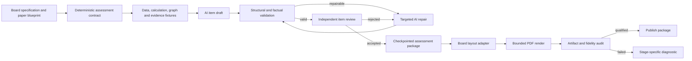

# Contract-First Paper Generation and Release Qualification

**Date:** 2026-08-23
**Status:** Approved in chat; awaiting written-spec review

## Purpose

Paper Creator must generate genuinely new A-level examination papers and mark schemes while matching the structure, typography, page geometry, density, difficulty profile, assessment-objective distribution, and marking depth of the relevant exam-board papers. It must do this reliably on supported Macs, preserve completed work across failures, and make adding a subject, specification, or board a configuration-led task rather than another independent generator rewrite.

This design replaces the current late-validation pipeline with a shared contract-first workflow. AI remains responsible for original contexts, questions, and reasoning. Deterministic code owns facts that must be exact: marks, assessment objectives, numeric datasets, calculations, graph geometry, evidence references, pagination constraints, and release checks.

## Evidence and Current Baseline

The complete live qualification run used `gemma4:12b` through Ollama with a 16K context window and attempted all 18 supported board/paper combinations. It took 27,535 seconds (7h 38m 55s):

- 3 of 18 papers passed generation and validation.
- Aggregate structural and visual similarity for the successful artifacts was 66.5%.
- Question papers scored about 71-73%; mark schemes scored about 60-62%.
- Failures included invalid accounting arithmetic, order-sensitive numeric validation, misclassified pseudocode labels, AI graph data rejected as immutable source data, identical independent reviews, source hallucinations, weak mark-scheme depth, late graph-range failures, and two non-terminating OCR Economics mark-scheme renders.
- Successful artifacts still differed materially from their references in cover hierarchy, typography, spacing, line weights, answer-space allocation, tables, charts, supplementary pages, footer/barcode geometry, question density, and mark-scheme richness.
- A factual economics error passed automated review, proving that structural checks alone cannot qualify a paper.

The evidence is stored in `tmp/pdfs/live-full-matrix-2026-08-22/`, including `matrix-report.json`, `fidelity-report.json`, and `fidelity-report.md`. Those large generated artifacts remain untracked and are not release source files.

## Goals

1. Generate original, syllabus-valid questions and complete mark schemes without reproducing official question wording.
2. Make immutable assessment facts deterministic and independently verifiable.
3. Match each board's document grammar: page roles, geometry, typography, content density, diagrams, tables, answer space, and mark-scheme organization.
4. Reject or repair a bad item immediately instead of discovering it after generating an entire paper.
5. Checkpoint accepted work so interruption, retry, or renderer failure does not repeat successful AI calls.
6. Establish a repeatable 18-paper release qualification process with objective and manual gates.
7. Make new subjects and boards declarative wherever their behavior can be expressed as profiles, schemas, and blueprints.
8. Provide truthful, cancellable, resumable progress in the macOS app.

## Non-Goals and Product Boundaries

- The app will not copy official questions or mark schemes.
- It will not display official logos or imply endorsement. “Reference-identical” means equivalent document grammar and geometry while retaining a clear Paper Creator identity.
- Software checks cannot prove psychometric equivalence. Difficulty targets will use board evidence, expert rules, and model review until anonymized learner-performance data is available.
- The work will not introduce cloud dependence; local Ollama generation remains supported.
- It will not preserve duplicated family-specific behavior where a shared contract can express the same rule.

## Considered Approaches

### A. Patch Each Existing Failure

Fix the 15 observed failures inside their family generators and renderers. This is the quickest route to another matrix run, but it preserves late validation, repeated orchestration, all-or-nothing retries, inconsistent progress, and divergent renderer behavior. Similar defects would recur when a new family is added.

### B. Shared Contract-First Core with Board Adapters — Selected

Create a typed assessment package, deterministic data contracts, an item-level AI review loop, durable checkpoints, board-specific layout profiles, bounded rendering, and shared qualification gates. Existing generators migrate incrementally behind adapters, allowing defects to be fixed while establishing a reusable extension path. This best balances originality, reliability, fidelity, and delivery risk.

### C. Deterministic Templates with AI Prose Fill-In

Generate most questions from fixed templates and use AI only for surface wording. This would be fast and reliable, but originality would become shallow, question variety would decay, and richer subjects would be poorly served. Templates remain useful for calculations and diagram families, but not as the complete content model.

## Architecture

### 1. Assessment Contract

The shared core will define a versioned `AssessmentPackage` containing paper metadata, sections, items, mark-scheme entries, source material, deterministic datasets, diagrams, and provenance. Each question is governed by an `AssessmentContract` that declares:

- permitted topics, command words, marks, AO allocation, and difficulty band;
- required answer form and mark-scheme structure;
- immutable facts and values;
- generated data fields and their valid ranges;
- evidence identifiers the question and mark scheme may cite;
- visual components and answer-space needs;
- numeric token roles: assessment data, marks, dates, identifiers, display labels, and pseudocode line labels.

Numeric comparison will be role-aware. Immutable values are compared as multisets unless order is semantically declared. Marks, dates, identifiers, and line labels do not masquerade as question data. Values belonging to declared generated datasets are validated against their schema rather than rejected for not appearing in a prompt.

The package schema is independent of a renderer and serializable with an explicit schema version. A validated package can therefore be rerendered, audited, or migrated without another model call.

### 2. Deterministic Assessment Data

Code will generate and validate all arithmetic datasets, accounting relationships, graph coordinates, tables, and canonical answers. Subject-specific calculators recompute solutions from the source data and fail close to the relevant item.

Graph specifications will declare axis type, bounds, scale, series, labels, intercepts, allowed movement, and explanatory relationship. Generated values are clamped only when clamping preserves the intended economics or subject relationship; otherwise the item is regenerated. Renderers consume this graph specification rather than interpreting prose.

AO totals and item marks are locked by the blueprint. AI may propose indicative content, but cannot silently alter those allocations.

### 3. Item-Level AI Workflow

Each item follows one transaction:

1. Build a prompt from the contract, syllabus evidence, originality constraints, and deterministic fixtures.
2. Generate a structured draft.
3. Validate schema, marks, AO totals, calculations, data ranges, evidence binding, and source fidelity.
4. Request a genuinely independent review using a separate prompt and fresh review context.
5. Repair only the failing fields, then repeat validation and review within a bounded retry budget.
6. Commit the accepted item to the checkpoint before starting the next item.

An independent review that merely repeats the draft is not accepted. Review failures identify a rule and field path so the repair prompt is precise. Exhausted retries preserve all prior items and leave the job resumable from the failed item.

### 4. Evidence Binding and Factual Quality

Source documents and extracts are normalized into evidence records with stable IDs. Questions declare the evidence they require; every data-dependent mark-scheme claim cites an allowed evidence ID. Validation rejects unsupported named facts, transport links, income figures, market conditions, or other invented evidence.

The factual review layer combines deterministic subject rules with model review. High-risk relationships, such as exchange-rate effects, accounting identities, algorithms, and legal or technical definitions, have explicit validators or reference-backed rubrics. The reviewer must state the causal chain and check its direction, not merely label prose as plausible.

### 5. Mark-Scheme Quality

Mark schemes are first-class assessment artifacts rather than short answers expanded during rendering. Each entry records:

- exact mark and AO allocation;
- accepted answer points and required working;
- alternatives and equivalent formulations;
- common errors and limits on credit;
- evidence-bound indicative content;
- levels descriptors and best-fit instructions where applicable;
- calculation steps and follow-through rules;
- correspondence to every subpart.

Blueprint profiles define minimum content depth by item type and mark band. Page-count targets are achieved through authentic content and board-like density, never blank-page padding or inflated whitespace.

### 6. Board Layout Adapters

The shared renderer interface receives only a validated package plus a `BoardDocumentProfile`. Profiles own:

- page size, margins, baseline grid, columns, and role-specific frames;
- font families, weights, sizes, leading, and fallbacks;
- cover hierarchy and Paper Creator branding treatment;
- header, footer, folio, rule, barcode-like identifier, and continuation geometry;
- question numbering, mark boxes, answer lines, tables, charts, source-booklet, and supplementary-page components;
- expected page counts and content-density ranges by document role;
- mark-scheme grids, level tables, and annotation conventions.

Shared primitives provide measured layout boxes and deterministic pagination. A profile can customize composition without forking assessment logic. A new board supplies profiles, reference measurements, and render tests; a new subject supplies blueprints, calculators, evidence rules, and item schemas.

### 7. Bounded Rendering

Every layout loop must demonstrate progress by consuming content or advancing a page state. A non-progress watchdog reports the component, page role, item ID, and measured box after 10 seconds. Each question paper, mark scheme, and source booklet has a 30-second qualification budget once a validated package exists.

Rendering is idempotent and separate from generation. A failed renderer can be fixed and rerun from the checkpoint. Partial PDFs are written to temporary paths and atomically promoted only after page-count, text, font, and geometry checks pass.

### 8. Progress, Cancellation, and Resume

The job model exposes stable stages: contract construction, item generation, validation, review, checkpoint, question-paper render, mark-scheme render, source render, artifact audit, and qualification. Overall progress derives from completed weighted units, not model status strings. Retries keep the same item position and display their attempt count.

Cancellation stops after the current safe boundary and retains the checkpoint. On restart, the app verifies the package version and resumes at the first incomplete item or stage. The UI presents actionable errors and offers retry, resume, or rerender where safe.

## Failure Handling and Transactionality

- Validation errors never mutate an accepted checkpoint.
- Every failure is typed as contract, AI transport, AI content, independent review, renderer, artifact, or qualification failure.
- Retry policies differ by type; deterministic failures are not sent repeatedly to the model without changing the repair instruction.
- Model requests have timeouts and bounded retries with backoff.
- Checkpoints include hashes of blueprint, profile, model configuration, prompt version, and fixtures. A mismatch requires explicit migration or regeneration.
- Published packages are immutable and contain a qualification manifest linking every artifact to its checks.

## Release Qualification

A release candidate is qualified only when all of the following pass:

1. All 18 currently supported papers generate and publish from clean checkpoints.
2. No invariant, calculation, factual-direction, AO-allocation, evidence-binding, or mark-total error remains.
3. Every registered document role has its exact expected page count; unregistered roles stay within the profile's justified range.
4. Question-paper visual similarity is at least 85%, mark-scheme similarity at least 80%, aggregate similarity at least 83%, and no page scores below 65% without an approved explained exception.
5. Text containment, font substitution, clipping, overlap, orphan, blank-page, and content-density audits pass on every page.
6. Rendering a validated document role completes within 30 seconds and no layout operation makes zero progress for 10 seconds.
7. Every generated page is rendered to an image and manually compared with its role-matched official reference. Review records cover typography, geometry, density, tables, graphs, answer space, numbering, mark boxes, and mark-scheme depth.
8. Subject review samples every command-word and difficulty band. Deterministic solution recomputation and evidence checks cover every item.
9. macOS build, tests, signing configuration, sandbox entitlements, accessibility checks, keyboard navigation, cancellation, resume, and packaging checks pass.

These thresholds are minimum release gates, not claims of psychometric equivalence. Learner outcome data will be needed to calibrate difficulty statistically.

## Verification Strategy

### Regression Tests for Observed Failures

- Reordered immutable numeric values are accepted when order is not semantic.
- Pseudocode line labels and item numbers are excluded from data-token comparison.
- Declared AI-generated graph data is accepted only within its graph schema.
- A changed immutable value such as 225 to 169 is rejected at that item.
- Accounting contribution and profit relationships are recomputed correctly.
- A review identical to its draft is rejected immediately and retried locally.
- Unsupported source claims and the observed Edexcel evidence hallucinations are rejected.
- AO allocations cannot drift during drafting or repair.
- Invalid graph coordinates fail before later paper items are generated.
- OCR Economics mark-scheme pagination terminates under adversarial long content.
- AQA Business mark schemes meet content-depth and page-density contracts.
- Exchange-rate causal directions and comparable high-risk rules are factually checked.

### Test Layers

- Unit tests cover contracts, token roles, calculators, graph schemas, evidence binding, pagination progress, and profile metrics.
- Property tests generate numeric datasets and verify that canonical solutions and render inputs remain consistent.
- Integration tests create packages with fake AI responses and exercise retry, repair, checkpoint, resume, and rerender.
- Golden tests compare board-specific page roles at text-box and rendered-image levels.
- Live tests run the full 18-paper matrix against the recommended Ollama model.
- Manual qualification reviews every output page and records findings in a machine-readable review manifest.

Tests will be written before each regression fix and retained after migration.

## Migration Sequence

### Phase 1: Shared Quality Core

Introduce the versioned package and contract types, numeric roles, evidence binding, deterministic fixture interfaces, checkpoint store, item transaction, and typed errors. Add regression tests before moving family code.

### Phase 2: Family Defects and Adapters

Migrate generators one family at a time. First address the observed Accounting, Business, Computer Science, OCR Economics, AQA Economics, and Edexcel Economics failures. Keep compatibility adapters only while callers migrate, then remove dead duplicate paths.

### Phase 3: Rendering Fidelity

Extract measured board profiles from the reference corpus, implement shared layout primitives, add bounded pagination, and qualify each document role against golden geometry and image comparisons.

### Phase 4: macOS Job Experience

Connect checkpointed stages to truthful progress, cancellation, resume, rerender, diagnostics, and qualification presentation. Preserve native SwiftUI patterns, accessibility, keyboard behavior, window sizing, and macOS Human Interface Guidelines.

### Phase 5: Full Qualification and Cleanup

Run the full live matrix, render and inspect every page, resolve all failures, remove superseded generators/tests/fixtures only after coverage proves they are unused, update documentation, and produce the qualification manifest.

Each phase is a coherent commit. Graphify is updated after code changes. Work remains on `main`, no remote push occurs without user direction, and the worktree is clean at every handoff.

## Extensibility Contract

A subject integration supplies:

- specification and topic taxonomy;
- paper and question blueprints;
- item schemas and deterministic calculators;
- factual rules and evidence adapters;
- command-word, AO, mark, and difficulty distributions;
- subject diagram primitives where needed.

A board integration supplies:

- document profiles and measured layout references;
- numbering and mark-scheme conventions;
- page-role registry and expected density/page counts;
- branding-safe cover treatment;
- golden artifact fixtures and thresholds.

The support registry composes a subject integration, board integration, specification version, and paper blueprint. Unsupported combinations fail explicitly. Capability discovery powers the UI, so adding a registered integration does not require hard-coded view changes.

## Acceptance and Rollout

Implementation is complete only when the full qualification gate passes, the committed qualification report contains no unresolved blocking findings, all automated suites and the macOS release build pass, Graphify reflects the final architecture, and Git is clean. A paper family may be marked experimental before then, but the application and documentation must not describe the complete product as finalized.

The first implementation plan will decompose the migration into independently testable commits while retaining a runnable application after each phase. If a phase exposes a broader interface change, the design document is amended and reviewed before that scope is implemented.
