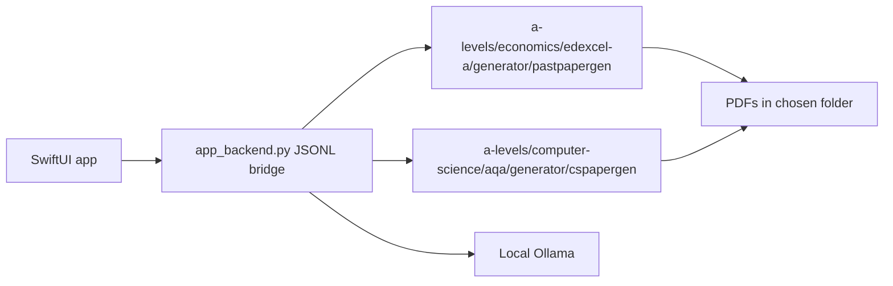

# Past Paper Creator Mac App

Native macOS SwiftUI app for the Economics and Computer Science generators.

## Build

```bash
make build
make build-app-store
make preflight-app-store
```

If Xcode is installed but `make build` fails because Command Line Tools are selected:

```bash
sudo xcode-select -s /Applications/Xcode.app/Contents/Developer
```

## Architecture



## Distribution

- Direct website build: may open Ollama download and pull models with user consent.
- App Store build: run `make build-app-store`; it disables installer/model-management features and only detects an existing Ollama setup.
- App Store submissions must be self-contained. The current development build finds the local checkout; a submitted bundle must include any Python backend/helper it needs inside the signed app bundle.
- Both builds show the unofficial exam-paper disclaimer and use user-selected output folders.
- Optional macOS notifications report job start/completion/failure; notifications are never required for app functionality.
- App Store review notes should state that exam-board names are descriptive only and the app is not affiliated with any exam board.
- App Store metadata should not use exam-board logos, imply official status, or advertise unavailable subjects.
- `APP_STORE_SUBMISSION_NOTES.md` contains the reviewer-access and metadata checklist.

## Privacy

- Ollama generation stays local.
- Hosted OpenAI and Anthropic generation is optional and requires explicit in-app consent before prompts leave the Mac.
- API keys are stored in Keychain with device-only accessibility.
- No analytics, advertising SDKs, tracking, accounts, or telemetry are included.
- Generated PDFs are written only to the selected output folder.
- API keys can be removed by clearing the fields in Settings. Local preferences can be reset by deleting the app container/preferences.

## Interface

- Uses native SwiftUI controls: sidebar, grouped forms, toolbar items, control groups, tables and settings scene.
- Uses Liquid Glass only for the top-level generate/status controls on macOS 26+, with standard material fallbacks on older macOS versions.
