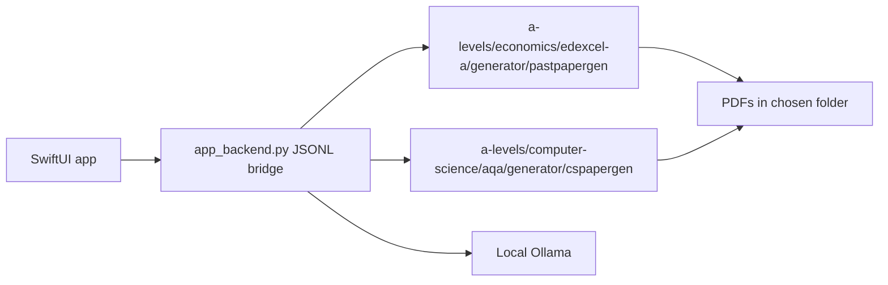

# Past Paper Creator Mac App

Native macOS SwiftUI app for the Economics and Computer Science generators.

## Build

```bash
make build
```

If Xcode is installed but `make build` fails because Command Line Tools are selected:

```bash
sudo xcode-select -s /Applications/Xcode.app/Contents/Developer
```

## Architecture



## Distribution

- Direct website build: may open Ollama download and pull models with user consent.
- App Store build: must disable installer/model-management features and only detect an existing Ollama setup.
- Both builds show the unofficial exam-paper disclaimer and use user-selected output folders.

## Interface

- Uses native SwiftUI controls: sidebar, grouped forms, toolbar items, control groups, tables and settings scene.
- Uses Liquid Glass only for the top-level generate/status controls on macOS 26+, with standard material fallbacks on older macOS versions.
